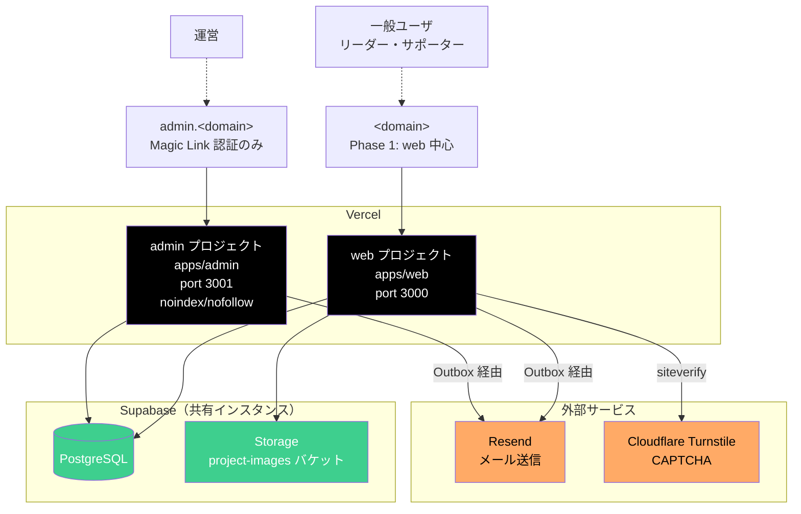
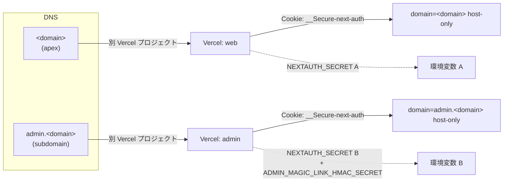
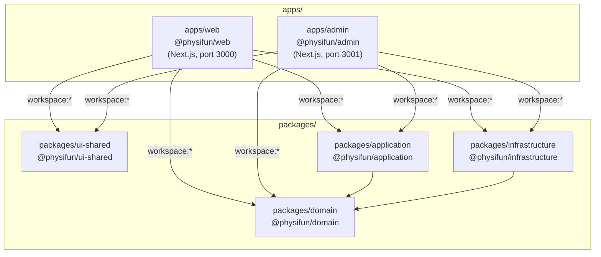
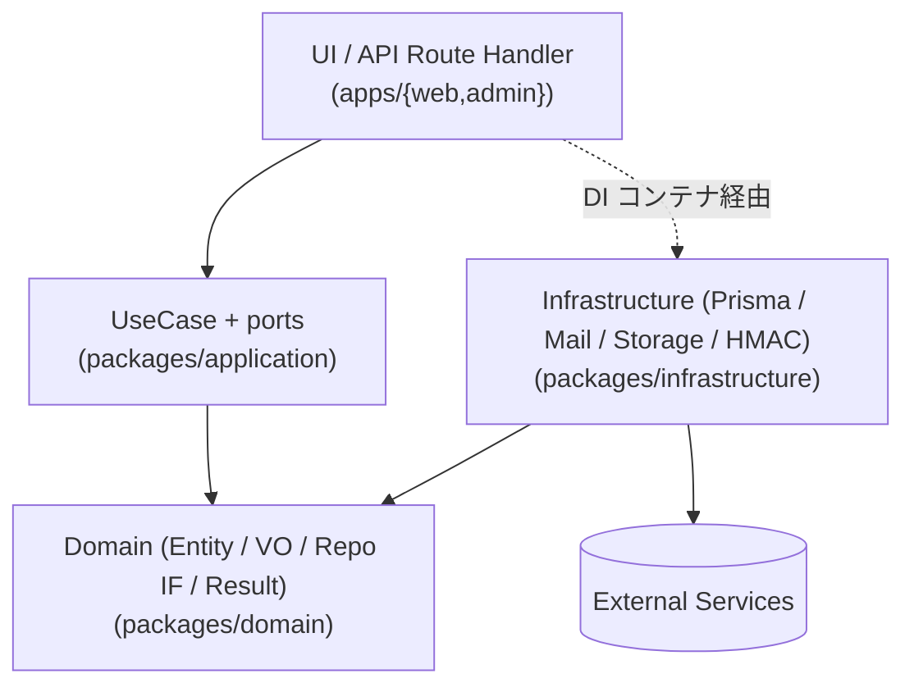
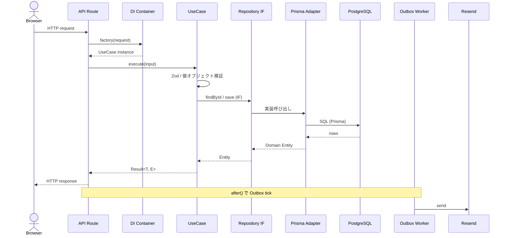
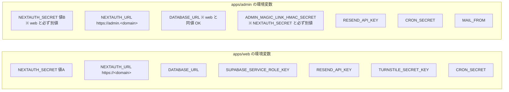
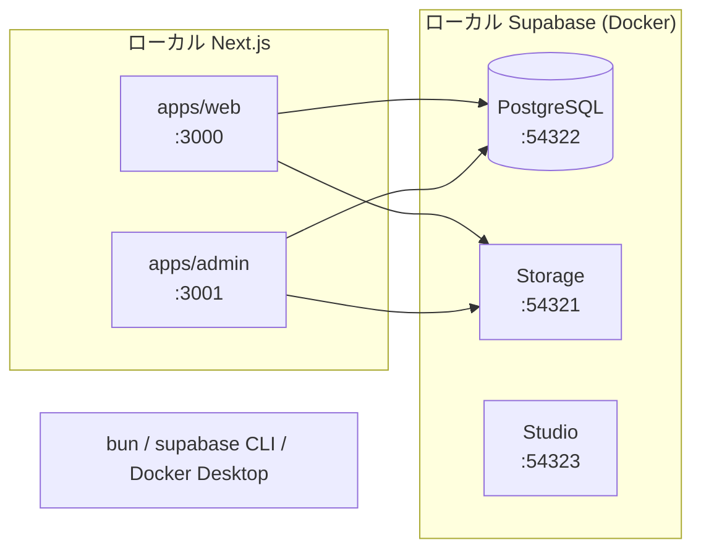
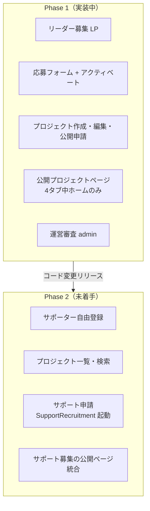

# 01. システムアーキテクチャ

PhysiFun のシステム全体構成を、インフラ・monorepo・レイヤード設計の視点で俯瞰するドキュメント。

## このドキュメントの位置づけ

- **目的**: AI / 人間が「PhysiFun の全体像」を最初に把握するエントリポイント
- **正本**: `package.json` 群 / `vercel.json` 群 / `.docs/tech.md` / `.docs/structure.md`。本書はその視覚化・統合
- **揮発度**: 低（インフラ構成・パッケージ構造の変更時のみ更新）
- **関連**:
  - `.docs/tech.md` — 技術スタック詳細・環境変数・将来の AWS 移行方針
  - `.docs/structure.md` — ディレクトリ構成・レイヤー責務・命名規則
  - `02_domain-model.md` — ドメイン層の詳細
  - `03_data-model.md` — データモデルの詳細
  - `04_security-design.md` — 認証・認可・データ保護
  - `05_key-flows/` — 主要フローのシーケンス

> 💡 **本書を最初に読むと、他の設計仕様の位置づけが分かる**よう構成している。

---

## 1. システム全体の俯瞰



### 1.1 主要コンポーネント

| コンポーネント | 役割 |
|---|---|
| **apps/web (Vercel)** | 一般ユーザ向け Next.js アプリ（LP / 応募 / マイページ / 公開プロジェクトページ） |
| **apps/admin (Vercel)** | 運営管理 Next.js アプリ（応募審査 / プロジェクト審査 / 監査ログ） |
| **Supabase PostgreSQL** | メイン DB。**両アプリで同一インスタンスを共有**（テーブルは Phase 別分離なし） |
| **Supabase Storage** | プロジェクトカバー画像など（`project-images` バケット） |
| **Resend** | 全メール送信（アクティベーション・通知・Magic Link） |
| **Cloudflare Turnstile** | リーダー応募フォームの CAPTCHA |

> 💡 **Supabase は同一インスタンスを共有**するが、**Cookie・セッション・環境変数は完全分離**。詳細は §3 / `04_security-design.md` 参照。

---

## 2. ホスティング・サブドメイン分離



### 2.1 完全分離の効果

- **Cookie の漏洩範囲を限定**: 一方のドメインで XSS が起きても、もう一方の Cookie は触れない（host-only Cookie）
- **環境変数の分離**: 一方のシークレット漏洩がもう一方に波及しない
- **デプロイの独立性**: web のデプロイ失敗で admin が止まらない / admin の更新でリーダーが影響を受けない
- **可観測性の独立**: それぞれの Vercel ダッシュボードで独立に監視

### 2.2 admin 側の追加防御

`apps/admin/vercel.json`:

```json
{
  "headers": [{
    "source": "/(.*)",
    "headers": [{ "key": "X-Robots-Tag", "value": "noindex, nofollow" }]
  }]
}
```

→ **検索エンジンインデックス禁止**。誤って admin URL がリークしても検索流入は防げる。

---

## 3. Monorepo 構成

`bun workspaces` で管理。



### 3.1 ワークスペースのルール

- 全ワークスペースは `@physifun/*` 名前空間
- `workspace:*` プロトコルで内部依存（バージョン管理不要）
- ルートで `bun install` するとシンボリックリンクが張られ、コード変更が即時反映

### 3.2 共有パッケージの責務（要点）

| パッケージ | 役割 | 詳細参照 |
|---|---|---|
| `domain` | エンティティ / 値オブジェクト / リポジトリ IF / `Result` 型 | `02_domain-model.md` |
| `application` | ユースケース（ビジネスロジック）+ ports | — |
| `infrastructure` | Prisma 実装 / Outbox / メール / Storage / Bcrypt / HMAC 等 | `03_data-model.md` |
| `ui-shared` | 両アプリ共通の UI コンポーネント・設定 | — |

詳細なディレクトリ構造とレイヤー責務は `.docs/structure.md` 参照。

---

## 4. レイヤード構成（依存方向）



**依存ルール:**

- **`domain` は何にも依存しない**（pure TypeScript）
- **`application` は `domain` のみに依存**（外部ライブラリ無し）
- **`infrastructure` は `domain` のみに依存**（実装詳細）
- **`apps/*` は全層に依存可**（DI で組み合わせる）
- API Route Handler は **薄く**保ち、UseCase に処理を委ねる
- ビジネスロジックは **`application/use-cases/` に集約**
- DB / Storage / 外部 API は **`infrastructure/` 内のみ**

詳細は `.docs/structure.md` §レイヤー別責務参照。

### 4.1 リクエスト → DB / メールの流れ（CRUD パターン）



詳細フロー（応募・公開審査・Magic Link・Outbox）は `05_key-flows/` 参照。

---

## 5. ランタイム実行環境

### 5.1 Vercel Functions

| 種別 | 用途 |
|---|---|
| **Server Component** | 認証チェック・DB 読み取りを伴うページ（`/my/...`、admin 配下） |
| **API Route Handler** | クライアント・運営からの状態変更（`/api/...`） |
| **Cron** | 定期処理（後述） |

> 💡 admin の Server Component は `export const dynamic = "force-dynamic"` を必須とする規約あり（`.docs/structure.md` 参照）。

### 5.2 Cron スケジュール

| アプリ | Path | スケジュール | 役割 |
|---|---|---|---|
| web | `/api/cron/cleanup-expired-accounts` | `0 0 * * *` (daily) | 72h 経過の `PENDING_EMAIL_CONFIRMATION` Account を物理削除 |
| web | `/api/cron/process-outbox` | `0 0 * * *` (daily) | LeaderApplication / Project Outbox の処理（A 経路） |
| admin | `/api/cron/gc-admin-auth` | `0 0 * * *` (daily) | 期限切れ `AdminVerificationToken` / `AdminSession` を削除 |

> ⚠️ **すべて daily** は Vercel Hobby プラン制約。**Pro プラン化後は `* * * * *`（毎分）に切り替える**ことが必要（`process-outbox` のメール送信 SLA 30s〜1min を満たすため、Issue #187）。

### 5.3 即時トリガー（Outbox の B 経路）

UseCase 完了後に Next.js `after()` でワーカーを呼ぶ。Hobby プランでも数秒以内のメール送信を実現する仕組み。詳細は `05_key-flows/outbox-mail.md` 参照。

---

## 6. 環境変数の二系統分離



**分離原則:**

- `NEXTAUTH_SECRET` は **必ず別値**
- `ADMIN_MAGIC_LINK_HMAC_SECRET` は admin 側のみ。**`NEXTAUTH_SECRET` と必ず別値**（同値だと起動拒否）
- `DATABASE_URL` は同じインスタンスを指すので同値で OK
- 各 Vercel プロジェクトの環境変数 UI で独立に管理

詳細は `04_security-design.md` §10 参照。

---

## 7. ローカル開発環境



| ツール | 用途 |
|---|---|
| Bun | パッケージマネージャ + ランタイム |
| Supabase CLI | ローカル PostgreSQL + Storage + Studio の起動 |
| Docker Desktop | Supabase のコンテナ実行基盤 |

セットアップ手順は `README.md` および `.docs/tech.md` 参照。

---

## 8. SEO / レンダリング戦略

| ページ種別 | レンダリング | 理由 |
|---|---|---|
| LP（トップページ） | SSG | SEO 対象はここのみ |
| 公開プロジェクト詳細 | SSR or ISR | Phase 2 で本格活用 |
| マイページ系 | CSR | 認証後のため SEO 不要 |
| admin 全画面 | Server Component (`force-dynamic`) | 常に最新表示。SEO 対象外（noindex） |

> 💡 Phase 1 では `/projects/[slug]` に `robots: { index: false, follow: false }` を付与中。Phase 2 で外す予定。

---

## 9. Phase 別のスコープ俯瞰



**Phase 1 → Phase 2 の移行**は**ランタイムフィーチャーフラグではなくコード変更リリース**で行う方針（`.docs/product.md` 参照）。

> 💡 `SupportRecruitment` / `RecruitmentSchedule` / `SupportTicket` は **Prisma schema のみ存在**し、ドメイン層・UI 実装は無い（Phase 2 候補）。詳細は `02_domain-model.md` §8、`03_data-model.md` §3 参照。

---

## 10. 将来の AWS 移行方針

`.docs/tech.md` に詳細な移行候補が記載されている。要点だけ：

| 現在 | 将来（AWS） |
|---|---|
| Vercel 静的配信 | CloudFront + S3 |
| Vercel API Routes | API Gateway + Lambda（または Amplify Hosting / OpenNext / SST） |
| Supabase PostgreSQL | RDS PostgreSQL |
| NextAuth.js | Cognito（または継続） |
| Supabase Storage | S3 |

**移行に備えた現在の設計指針:**

- **Supabase SDK の直接呼び出しは `infrastructure/` 層のみ**
- **ビジネスロジックに Supabase 依存を持ち込まない**
- **環境変数で接続先を切り替えられる構造を維持**
- **`packages/{domain, application}` は Vercel/AWS 両方で動く想定で書く**

レイヤー分離が AWS 移行時のコード変更量を最小化する設計上の保険になっている。

---

## 11. 改訂履歴

| 日付 | 改訂内容 | 担当 |
|---|---|---|
| 2026-05-09 | 初稿作成（Phase 1 実装時点のシステム俯瞰、インフラ図・monorepo・レイヤー・Cron・環境変数分離・将来展望） | 設計チーム |
