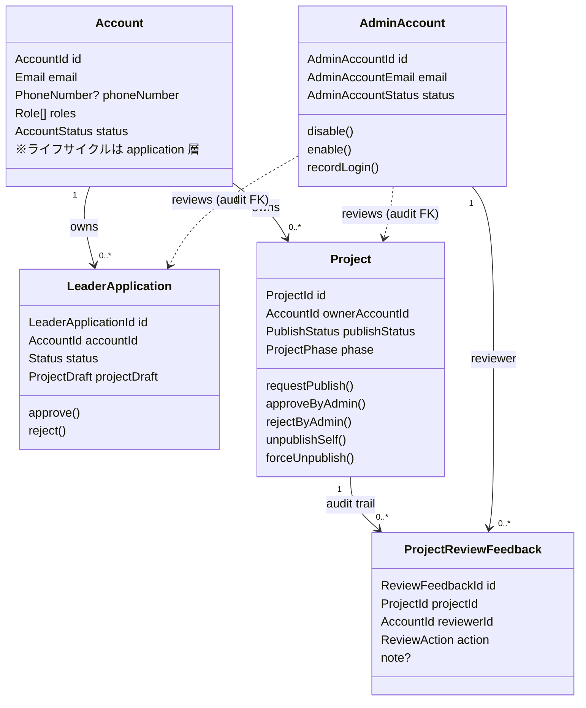
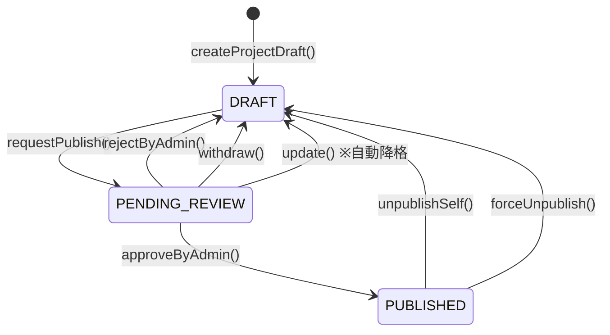
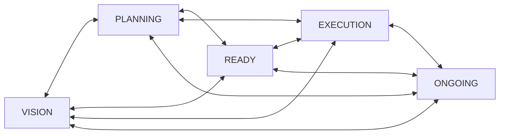
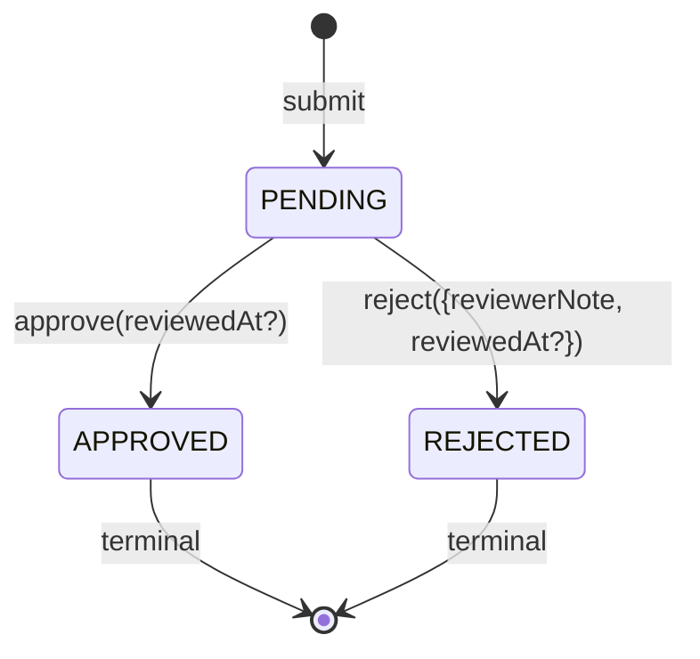
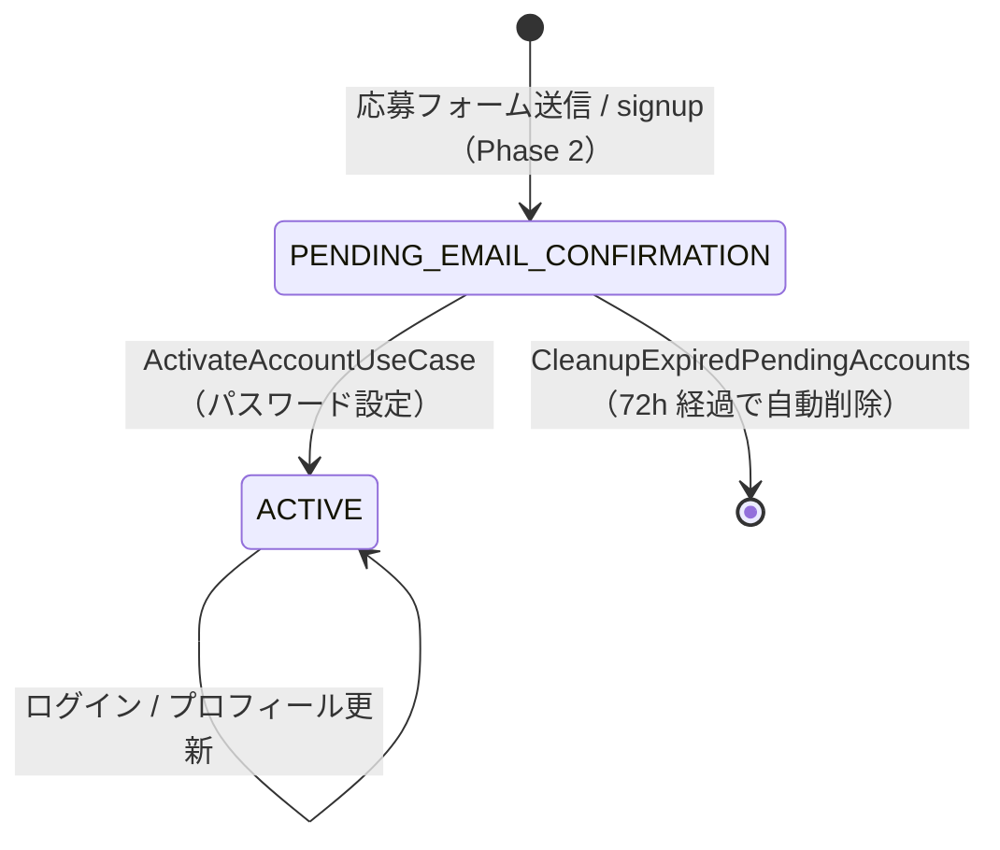
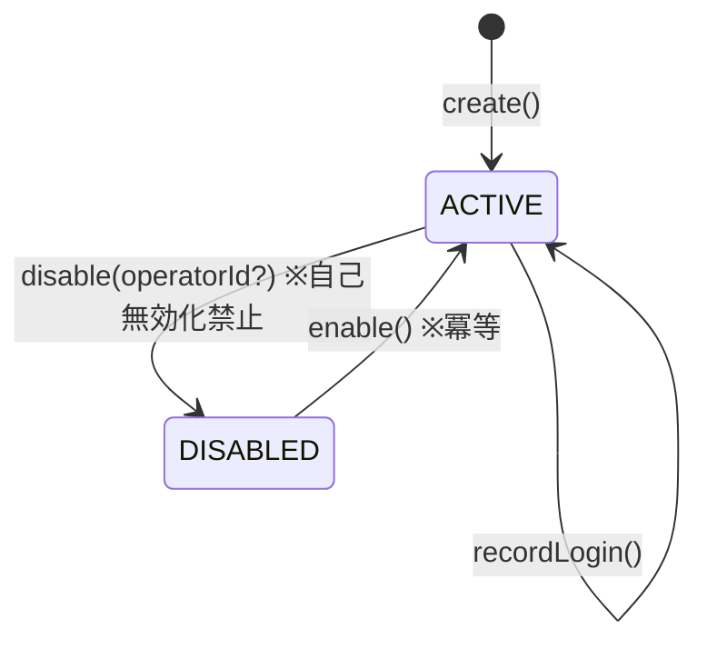

# 02. ドメインモデル

PhysiFun のドメイン層（`packages/domain/`）の構造を、アグリゲート単位で俯瞰するドキュメント。

## このドキュメントの位置づけ

- **目的**: AI / 人間が「アグリゲートの境界 / 状態 / 不変条件 / 関係」を素早く把握する地図
- **正本**: コード（`packages/domain/src/`）。本書はその**構造意図の地図**
- **揮発度**: 中（機能追加時に同 PR で更新）
- **関連**:
  - `00_terminology.md` — コード視点の用語集
  - `03_data-model.md` — Prisma schema → ER 図（DB レベルの詳細）
  - `04_security-design.md` — Account / AdminAccount の認証・認可
  - `05_key-flows/` — 状態遷移を起こすユースケースのシーケンス図

---

## 1. バウンデッドコンテキスト一覧

| Bounded Context | 役割 | 実装状況 |
|---|---|---|
| `account` | 一般ユーザのアカウント（Supporter / Leader） | ⚠️ 最小実装（後述） |
| `admin-account` | 運営アカウント（独立アグリゲート、Magic Link 認証） | ✅ Phase 1 実装済み |
| `leader-application` | リーダー応募と運営審査 | ✅ Phase 1 実装済み |
| `project` | プロジェクト本体（CRUD・公開審査・運営強制非公開） | ✅ Phase 1 実装済み |
| `recruitment` | サポート募集（時間/スキル）+ サポーター申請 | ⚠️ Phase 2（Prisma schema のみ、ドメイン層未実装） |

> 💡 `account` と `admin-account` は **完全に独立したアグリゲート**。Cookie・セッション・Vercel プロジェクトも分離（`apps/web` ↔ `apps/admin`）。詳細は `04_security-design.md` 参照。

---

## 2. アグリゲート関係図（俯瞰）



**関係性の特徴:**

- `LeaderApplication` と `Project` の間に **直接の参照は無い**（応募時の `ProjectDraft` は値オブジェクトのスナップショット）。
- `AdminAccount` から他アグリゲートへの参照は **すべて監査用**。物理削除を防ぐため Prisma 側で `onDelete: Restrict` を設定。
- すべての即時的な所有関係を除き、参照は **nullable または audit 専用**。

---

## 3. Project アグリゲート

### 3.1 役割

リーダーが立ち上げるプロジェクトの本体。CRUD と公開審査ワークフローを保持する。

### 3.2 ルートエンティティ

`packages/domain/src/project/entities/Project.ts:45`

| フィールド | 型 | 説明 |
|---|---|---|
| `id` | `ProjectId` | UUID（不変） |
| `ownerAccountId` | `AccountId` | リーダーアカウント（不変） |
| `title` | `string (1-100)` | 必須 |
| `publishStatus` | `PublishStatus` | DRAFT / PENDING_REVIEW / PUBLISHED |
| `phase` | `ProjectPhase` | VISION / PLANNING / READY / EXECUTION / ONGOING（ラベルのみ） |
| `summary` | `string (max 300)` | 概要（公開には必須） |
| `body` | `string (max 10000)` | 本文（公開には必須） |
| `leaderIntroduction` | `string (max 2000)` | リーダー紹介（公開には必須） |
| `coverImageUrl` | `string` | カバー画像（公開には必須） |
| `category` | `ProjectCategory` | カテゴリー（公開には必須） |
| `location` | `ProjectLocation` | 都道府県＋市町村（公開には必須） |
| `snsLinks` | `SnsLinks` | x / instagram / facebook / website |
| `activityPlan` | `string (max 1000)` | 活動計画（公開時も任意） |
| `createdAt` / `updatedAt` | `Date` | |

### 3.3 値オブジェクト

| 値オブジェクト | ファイル | 役割 |
|---|---|---|
| `ProjectId` | `packages/domain/src/project/value-objects/ProjectId.ts` | UUID |
| `PublishStatus` | `packages/domain/src/project/value-objects/PublishStatus.ts` | 公開状態 |
| `ProjectPhase` | `packages/domain/src/project/value-objects/ProjectPhase.ts` | フェーズラベル |
| `ReviewAction` | `packages/domain/src/project/value-objects/ReviewAction.ts` | APPROVED / REJECTED / FORCE_UNPUBLISHED |

`ProjectCategory` / `ProjectLocation` / `SnsLinks` は **共有値オブジェクト**（後述）。

### 3.4 サブエンティティ：ProjectReviewFeedback

`packages/domain/src/project/entities/ProjectReviewFeedback.ts:26`

Project の公開審査履歴を残す監査用エンティティ。

| フィールド | 型 | 説明 |
|---|---|---|
| `id` | `ReviewFeedbackId` | UUID |
| `projectId` | `ProjectId` | 親 Project |
| `reviewerId` | `AdminAccountId` | 監査者（運営） |
| `action` | `ReviewAction` | APPROVED / REJECTED / FORCE_UNPUBLISHED |
| `note` | `string? (max 2000)` | REJECTED / FORCE_UNPUBLISHED は必須 |
| `reviewedAt` | `Date` | |

### 3.5 リポジトリ

| インターフェース | ファイル | 主要メソッド |
|---|---|---|
| `ProjectRepository` | `packages/domain/src/project/repositories/ProjectRepository.ts:9` | `save()`, `findById()`, `countByOwner(accountId, statuses[])` |
| `ProjectReviewFeedbackRepository` | `packages/domain/src/project/repositories/ProjectReviewFeedbackRepository.ts:7` | `save()`, `findLatestByProjectId()` |

### 3.6 状態遷移：PublishStatus



**ガード条件:**

- `DRAFT → PENDING_REVIEW`: `coverImageUrl` / `category` / `location` / `summary` / `body` / `leaderIntroduction` がすべて非 null。`activityPlan` は任意。
- `PUBLISHED` の `update()`: 上記必須フィールドを null に戻すことは禁止。
- `PENDING_REVIEW` 中に `update()` した場合は **自動的に DRAFT へ降格**（再申請が必要）。

### 3.7 ProjectPhase は状態遷移しない（ラベルのみ）

`ProjectPhase` は VISION / PLANNING / READY / EXECUTION / ONGOING のいずれの値間も **任意の方向に遷移可能**。リーダーが現状を表現するための **ラベル** であり、状態機械ではない。



> ⚠️ ProjectPhase は順序や遷移制約を持たない。例えば `ONGOING` から `VISION` に戻すことも可能。

### 3.8 主要な不変条件

- `title` は trim 後 1〜100 文字（必須）
- `summary` / `body` / `leaderIntroduction` / `activityPlan` は trim 後それぞれ最大 300 / 10000 / 2000 / 1000 文字
- `id` / `ownerAccountId` / `createdAt` は不変
- すべての `update()` は **guard-first, write-last** パターン（バリデーション完了後にのみ状態変更）

### 3.9 件数上限（application 層で enforce）

`CreateProjectDraftUseCase` で以下を判定:

- 1 アカウントあたり **合計 10 件**（DRAFT + PENDING_REVIEW + PUBLISHED）
- 1 アカウントあたり **PUBLISHED は最大 3 件**

> 数値は仮値（運営ポリシーで調整される想定）。判定は `CreateProjectDraftUseCase` 内で行う。

### 3.10 関連ユースケース

`packages/application/src/project/`

- `CreateProjectDraftUseCase`
- `UpdateProjectDraftUseCase`
- `RequestPublishUseCase`
- `WithdrawProjectUseCase`
- `UnpublishProjectUseCase`
- `ApproveProjectPublicationUseCase`
- `RejectProjectPublicationUseCase`
- `ForceUnpublishProjectUseCase`

---

## 4. LeaderApplication アグリゲート

### 4.1 役割

リーダー応募と、運営による審査の状態を保持する。承認時に `Account` に `LEADER` ロールが付与される（Account 側で実行）。

### 4.2 ルートエンティティ

`packages/domain/src/leader-application/entities/LeaderApplication.ts:26`

| フィールド | 型 | 説明 |
|---|---|---|
| `id` | `LeaderApplicationId` | UUID（不変） |
| `accountId` | `AccountId` | 応募者（不変） |
| `status` | `LeaderApplicationStatus` | PENDING / APPROVED / REJECTED |
| `projectDraft` | `ProjectDraft` | 応募時のプロジェクト案（不変・スナップショット） |
| `submittedAt` | `Date` | 不変 |
| `reviewedAt` | `Date?` | 審査完了時刻 |
| `reviewerNote` | `string? (max 2000)` | 却下理由（REJECTED 時必須） |

### 4.3 値オブジェクト：ProjectDraft

応募時の **プロジェクト案＋募集情報＋連絡情報** をスナップショットとして保持する複合値オブジェクト。
Issue #192 PR3-PR5（migration `20260501020000_extend_leader_application_fields` / `20260505010000_make_experience_offered_required`）で大幅拡張された。

#### プロジェクト案

| フィールド | 制約 |
|---|---|
| `projectTitle` | 必須・最大 60 文字（PR3 で 100→60 に短縮） |
| `projectSummary` | 必須・最大 150 文字 |
| `projectStory` | 必須・最大 300 文字（Markdown） |
| `projectCategory` | `ProjectCategory` |
| `location` | `ProjectLocation`（都道府県必須＋市町村任意） |
| `snsLinks` | `SnsLinks` |
| `progress` | `ProjectPhase`（応募時点のフェーズ） |

#### 連絡情報

| フィールド | 制約 |
|---|---|
| `phoneNumber` | 任意・最大 20 文字 |

#### 募集情報

| フィールド | 制約 |
|---|---|
| `recruitmentTypes` | `LeaderApplicationRecruitmentType[]` 必須（`TIME` / `SKILL_ITEM` から 1 件以上） |
| `experienceOffered` | 必須（提供できる体験の内容） |
| `activityContent` | `TIME` 選択時のみ必須（旧 `plannedActivities` をリネーム） |
| `eventLocation` | `TIME` 選択時のみ |
| `eventPeriod` | `TIME` 選択時のみ |
| `recruitCount` | `TIME` 選択時のみ・1 以上 |
| `skillItemNeeds` | `SKILL_ITEM` 選択時のみ |
| `skillItemDeadline` | `SKILL_ITEM` 選択時のみ |
| `timeReturn` | `TIME` 選択時のみ・リターン情報 |
| `skillItemReturn` | `SKILL_ITEM` 選択時のみ・リターン情報 |

> 💡 文字数上限・ラベル・選択肢は `packages/domain/src/leader-application/constants.ts` に集約（SSOT）。
> 💡 `LeaderApplicationRecruitmentType` (`TIME` / `SKILL_ITEM`) は `RecruitmentType` (`ACTIVITY`、`SupportRecruitment` 用) と **別 enum**。応募時の希望タイプと、実際の募集投稿タイプは概念的に異なるため意図的に分けている（名前空間衝突回避）。
> 💡 `ProjectDraft` は **`Project` と直接リンクしない**。応募時の意図を保存するためのスナップショットで、承認後は初期 `Project` 生成の入力として使われるが、参照関係は持たない（後述の `ApproveLeaderApplicationUseCase` 参照）。

### 4.4 リポジトリ

`packages/domain/src/leader-application/repositories/LeaderApplicationRepository.ts:14`

- `save()`
- `findById()`
- `existsPendingByAccountId(accountId)` — 重複応募チェック用（application 層が利用）

### 4.5 状態遷移



**不変条件:**

- 終端状態（APPROVED / REJECTED）からの再遷移は禁止（アグリゲートでガード）
- `reject()` には `reviewerNote` 必須（trim 後 1〜2000 文字）
- 1 アカウントあたり **PENDING は同時に 1 件のみ**（application 層で `existsPendingByAccountId` を使い enforce）

### 4.6 関連ユースケース

`packages/application/src/leader-application/`

- `SubmitLeaderApplicationUseCase`
  - reCAPTCHA / IP rate limit / 重複応募チェックを含む（PR #200 / #201 で追加）
  - ports: `CaptchaVerifierPort` / `IpRateLimitPort`
- `ApproveLeaderApplicationUseCase`
  - PENDING → APPROVED 遷移
  - 対象 Account に `LEADER` ロールを付与
  - **承認時に初期 `Project` を自動生成**（PR #199 で追加。応募時のスナップショットを Project の初期値として転写）
  - Outbox イベント発行
- `RejectLeaderApplicationUseCase`
  - 連続却下防止のため **10 分のクールダウン**を持つ

---

## 5. Account アグリゲート

### 5.1 設計判断：なぜ最小構成なのか

ドメイン層に存在するのは値オブジェクトのみ:

- `AccountId` — UUID
- `PhoneNumber` — `~20` 文字、ハイフン許可（`packages/domain/src/account/value-objects/PhoneNumber.ts`）

**ライフサイクルとロール管理は application 層**（`packages/application/src/account/`）と **NextAuth.js** に委譲している。理由:

- Phase 1 では「応募 → アクティベート → ログイン」しか必要なく、ドメインロジックが薄い
- パスワードハッシュ・セッション管理は NextAuth.js が抽象化済み
- 過剰な抽象化を避ける（`CLAUDE.md` の原則）

### 5.2 状態（Prisma レベル）

`packages/infrastructure/prisma/schema.prisma` 上の `Account` モデル:

- `status`: `PENDING_EMAIL_CONFIRMATION` / `ACTIVE`
- `roles`: `Role[]`（`SUPPORTER` / `LEADER`、複数保持可）
- 補足: `ADMIN` ロールは `Account.roles` には含まれない（`AdminAccount` 独立アグリゲート）

### 5.3 ライフサイクル



### 5.4 関連ユースケース

`packages/application/src/account/`

- `ActivateAccountUseCase` — トークン検証＋パスワードハッシュ＋状態遷移
- `CleanupExpiredPendingAccountsUseCase` — 72 時間経過 PENDING の cron 削除

### 5.5 ロール拡張：LEADER 付与

`LeaderApplication.approve()` の成功後、`ApproveLeaderApplicationUseCase` で対象 Account に `LEADER` ロールを追加する。具体的な書き込みは Prisma リポジトリ実装側で行う（ドメインに Account ルートエンティティが無いため）。

> 📌 将来的に Account ライフサイクルが複雑化したら、ドメインアグリゲート化を検討する余地あり（現状は不要）。

---

## 6. AdminAccount アグリゲート

### 6.1 役割

運営（`apps/admin`）専用のアカウント。**Web ユーザの `Account` とは完全に独立したアグリゲート**として設計されている。

### 6.2 ルートエンティティ

`packages/domain/src/admin-account/entities/AdminAccount.ts:20`

| フィールド | 型 | 説明 |
|---|---|---|
| `id` | `AdminAccountId` | UUID（不変） |
| `email` | `AdminAccountEmail` | 正規化・最大 255 文字 |
| `status` | `AdminAccountStatus` | ACTIVE / DISABLED |
| `lastLoginAt` | `Date?` | |
| `createdAt` / `updatedAt` | `Date` | |

### 6.3 値オブジェクト

| 値オブジェクト | 説明 |
|---|---|
| `AdminAccountId` | UUID |
| `AdminAccountEmail` | 正規化（lowercase / trim）後にバリデーション |
| `AdminAccountStatus` | ACTIVE / DISABLED |

### 6.4 リポジトリ

`packages/domain/src/admin-account/repositories/AdminAccountRepository.ts:11`

- `findByEmail()` / `findById()` / `create()` / `update()` / `findAll(page, perPage)`

### 6.5 状態遷移



### 6.6 主要な不変条件

- **自己無効化の禁止** — `disable()` の引数 `operatorId` が自身と一致するとエラー（`AdminAccount.ts:156` 付近）
- `enable()` / `disable()` は **冪等**（既に同状態なら無視 or サイレント）
- `id` / `createdAt` は不変
- 認証手段は **Magic Link のみ**（パスワード・TOTP・リカバリーコードは持たない）

### 6.7 他アグリゲートへの参照（監査用 FK）

| 参照元 | 参照先フィールド | 説明 |
|---|---|---|
| `Project` | `reviewedBy` | 公開承認・却下を行った運営 |
| `Project` | `forcedUnpublishedBy` | 強制非公開を実行した運営 |
| `LeaderApplication` | `reviewedBy` | 応募審査を行った運営 |
| `ProjectReviewFeedback` | `reviewerId` | 監査ログの主体（必須） |

> 📌 すべての FK は Prisma 側で `onDelete: Restrict`。AdminAccount を物理削除すると監査履歴が失われるため、運営退職時は `disable()` で論理無効化する。

### 6.8 認証方式

NextAuth.js の `EmailProvider`（Magic Link）+ `Database セッション` (TTL 1h)。
詳細は `04_security-design.md` 参照。

### 6.9 関連ユースケース

運営側のユースケースは `apps/admin/src/lib/` 配下の Server Component / Server Action で完結する設計（独立 application 層パッケージは現状不要と判断）。

---

## 7. 共有概念

### 7.1 Result 型

`packages/domain/src/shared/result.ts:17`

```ts
type Result<T, E> =
  | { ok: true; value: T }
  | { ok: false; error: E }
```

ヘルパー: `ok(value)` / `err(error)`

ユースケース層・アグリゲート層で例外の代わりに使用する。

### 7.2 共有値オブジェクト

`packages/domain/src/shared/value-objects/`

| 値オブジェクト | 役割 |
|---|---|
| `ProjectCategory` | `CATEGORY_MASTER` 配列で定義された enum 値（commerce / education / health 等） |
| `ProjectLocation` | 都道府県コード（JIS X 0401: `"01"`〜`"47"`）+ 市区町村（任意） |
| `SnsLinks` | x / instagram / facebook / website のオプション URL |

> 💡 これらは `LeaderApplication.ProjectDraft` と `Project` の両方で再利用される。

---

## 8. Phase 2 候補：Recruitment

### 8.1 現状

- **Prisma schema にモデル定義のみ存在**（`packages/infrastructure/prisma/schema.prisma:200-284`）
  - `SupportRecruitment`
  - `RecruitmentSchedule`
  - `SupportTicket`
- **ドメイン層・application 層の実装は無い**
- schema コメント: 「Phase 1 はリーダー側の作成 UI まで実装、サポーター側の申請は Phase 2」

### 8.2 Phase 2 移行時の留意点

- **新規バウンデッドコンテキスト** `recruitment` を `packages/domain/src/recruitment/` に作成
- アグリゲート境界の候補:
  - `SupportRecruitment` をルート、`RecruitmentSchedule` を子エンティティ（同一トランザクションで一貫性が必要）
  - `SupportTicket` は別アグリゲート（Supporter 起点で生成・キャンセルされるため）
- Project との関係: `SupportRecruitment.projectId` は **参照のみ**（Project が Recruitment を直接持たない）

### 8.3 リターン概念に関する注意

業務側で **「リターンは設定必須・リーダー設計・金銭リターンも可」** という方針が確定している（詳細はビジネス側ドキュメント参照）。

一方、過去のドメインスナップショットでは「リターン不採用」とされていた経緯があり、ドメイン層には現状リターン関連エンティティが存在しない。**Recruitment 実装時にリターン関連エンティティを新設または復活する必要あり**（廃止された `Return.ts` の再設計を含む）。

---

## 9. 主要な設計判断

### 9.1 なぜ `Account` と `AdminAccount` を分離したか

- **権限・脅威モデルが異なる**：運営は全データへのアクセス権を持つため、認証手段・セッション TTL・監査要件が一般ユーザと別
- **アプリ・Cookie・環境変数を完全分離**：サブドメイン分離で XSS 影響範囲を限定（`<domain>` ↔ `admin.<domain>`）
- **退職運用**：`AdminAccount` は物理削除せず `disable()` で監査履歴を残す
- 詳細: `04_security-design.md`

### 9.2 なぜ `ProjectDraft` は値オブジェクトなのか

- 応募時点でのプロジェクト案を **後の Project と独立に保存**したいため
- 承認後に Project が編集されても、応募時点の Snapshot は LeaderApplication に残る
- リーダーが応募内容と異なる方向にプロジェクトを進めても、応募時の意図は履歴として参照可能

### 9.3 なぜ `PublishStatus` と `ProjectPhase` を分離したか

- `PublishStatus` は **公開ライフサイクルの状態機械**（厳格な遷移ルール）
- `ProjectPhase` は **リーダーが自由に切り替えるラベル**（プロジェクトの主観的な進捗）
- 2 つを混同すると「公開中なのに VISION フェーズ」という違和感のある状態を強制ガードする必要が出てしまう。分離することで両者を独立に扱える。

### 9.4 なぜ `ProjectReviewFeedback` を独立サブエンティティにしたか

- 運営の審査履歴は **改ざん不能な監査証跡**として必要
- Project 本体に最新ステータスのみ持つと、過去の却下理由・強制非公開理由が失われる
- AdminAccount を `disable()` した後も誰が審査したかを残す必要がある（`onDelete: Restrict`）

### 9.5 なぜ `Result` 型を使うか

- 例外による制御フローを避ける（型システムで「失敗の可能性」を可視化）
- ユースケース層から API Route Handler への失敗伝搬を統一的に扱える
- 詳細: `packages/domain/src/shared/result.ts`

---

## 10. 改訂履歴

| 日付 | 改訂内容 | 担当 |
|---|---|---|
| 2026-05-09 | 初稿作成（Phase 1 実装時点のドメイン層を整理） | 設計チーム |
| 2026-05-09 | PR #199-#201 のドリフト反映：ProjectDraft 拡張 / 承認時の初期 Project 自動生成 / captcha・rate limit ports | 設計チーム |
