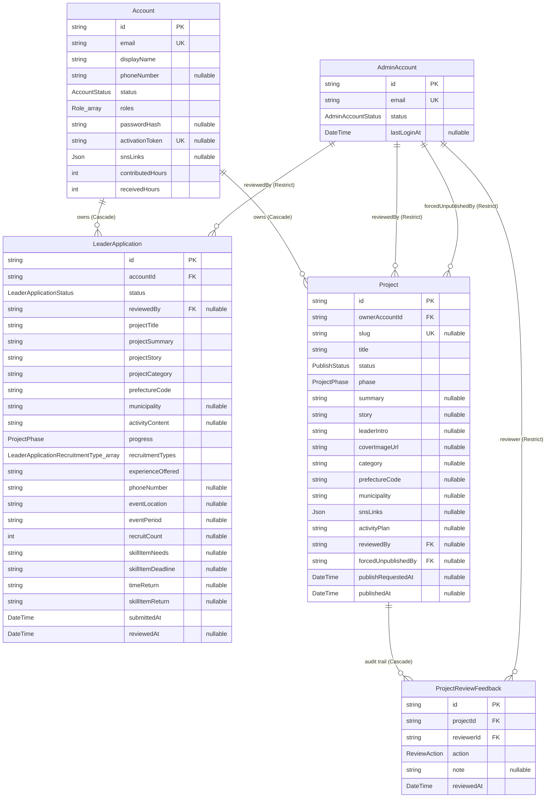
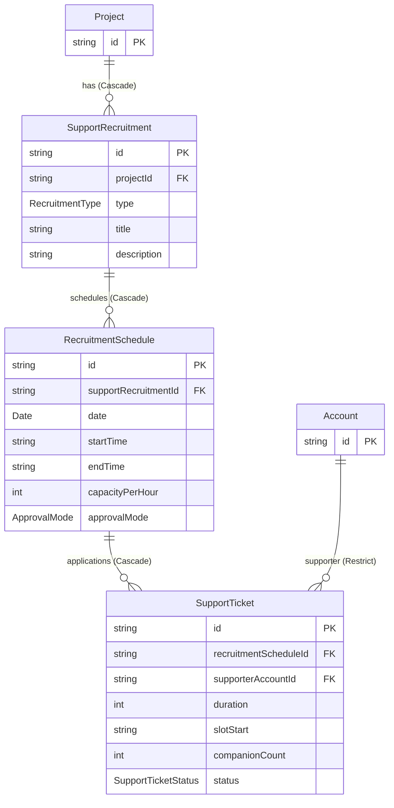
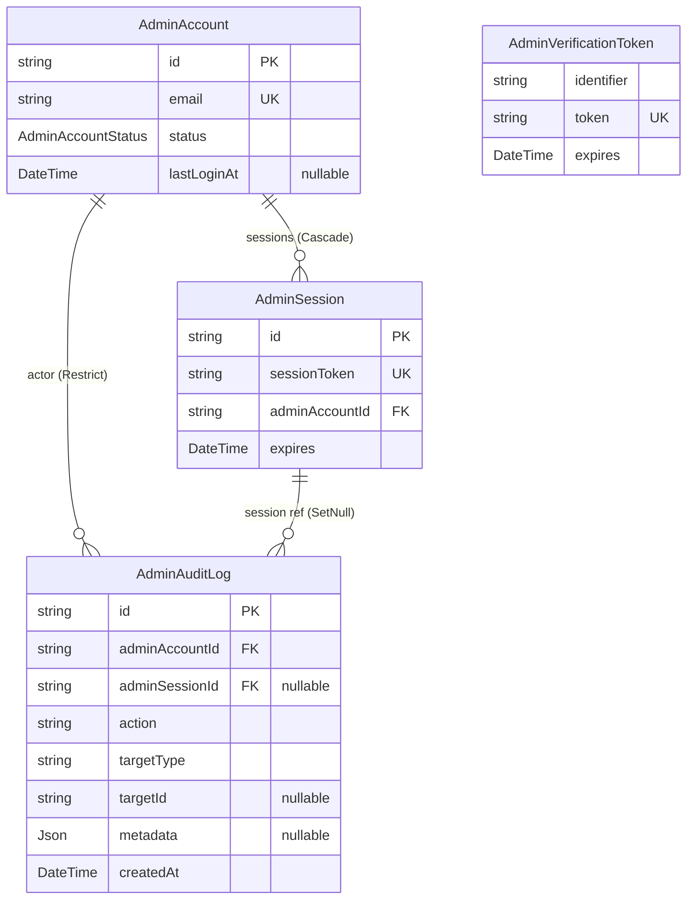
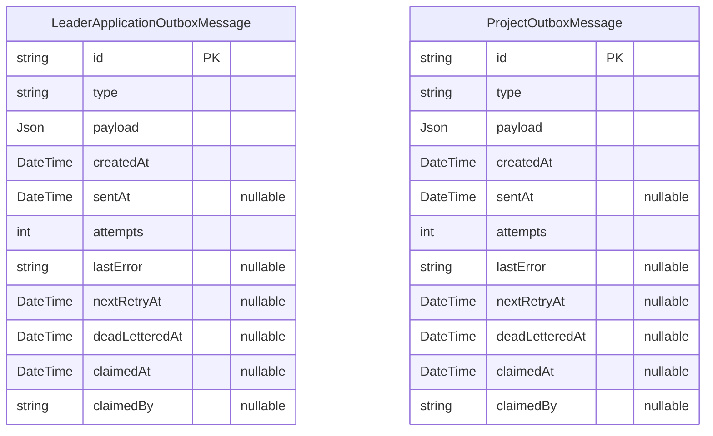
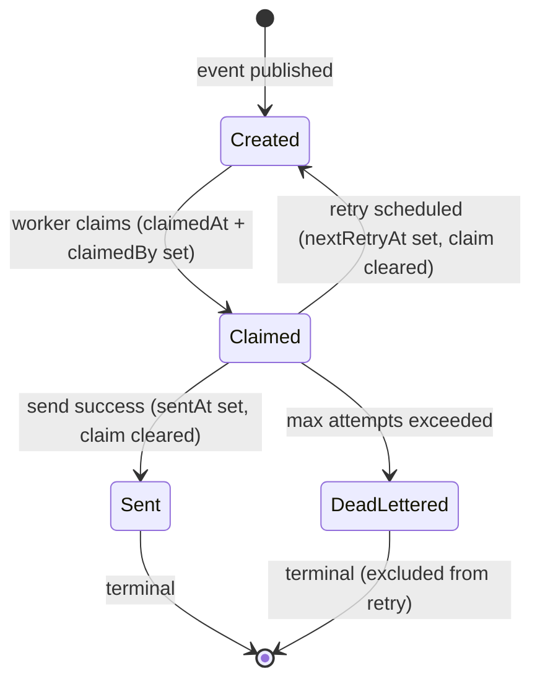

# 03. データモデル (ER 図)

`packages/infrastructure/prisma/schema.prisma` のデータモデルを Mermaid ER 図と表で可視化したドキュメント。

## このドキュメントの位置づけ

- **目的**: AI / 人間が「DB 構造とテーブル間の関係」を素早く把握する地図
- **正本**: `packages/infrastructure/prisma/schema.prisma`。本書はその視覚化。
- **揮発度**: 中〜高（Prisma スキーマ変更で都度更新）
- **関連**:
  - `02_domain-model.md` — ドメインアグリゲートとの対応
  - `04_security-design.md` — Restrict 制約の意図、AdminAuditLog の役割
  - `05_key-flows/` — Outbox の動作シーケンス
- **更新方針**: マイグレーションを追加するときは本書を同 PR で更新する

---

## 1. 全体俯瞰

| カテゴリ | モデル | Phase 1 | Phase 2 |
|---|---|---|---|
| ユーザー | `Account` | ✅ | ✅ |
| 応募 | `LeaderApplication` | ✅ | ✅ |
| プロジェクト | `Project` / `ProjectReviewFeedback` | ✅ | ✅ |
| 募集 | `SupportRecruitment` / `RecruitmentSchedule` / `SupportTicket` | ⚠️ schema のみ | 🚧 起動予定 |
| 運営 | `AdminAccount` / `AdminSession` / `AdminAuditLog` / `AdminVerificationToken` | ✅ | ✅ |
| イベント | `LeaderApplicationOutboxMessage` / `ProjectOutboxMessage` | ✅ | ✅ |

合計 **14 モデル / 10 enum**。

---

## 2. ER 図（コアドメイン）

**重要な関係性:**

- `LeaderApplication ↔ Project` の **直接の参照は無い**（応募内容は ProjectDraft スナップショットとして保存）
- `Account` 削除は所有関係（`LeaderApplication` / `Project`）に **Cascade** で連鎖
- `AdminAccount` への参照はすべて **Restrict**（監査履歴を物理削除から保護）

---

## 3. ER 図（Phase 2 候補：Recruitment）

> ⚠️ Phase 1 ではこれらのテーブルは **schema 定義のみ存在**し、ドメイン層・application 層の実装は無い。Phase 2 で起動予定。詳細は `02_domain-model.md` §8 参照。

**Recruitment まわりの注意:**

- `RecruitmentSchedule.date` は `@db.Date`（JST カレンダー日）。app 層が JST として扱う。
- `RecruitmentSchedule.startTime` / `endTime` は `"HH:MM"` 形式の string（JST）。
- `(supportRecruitmentId, date)` で **unique 制約**（1 募集 × 1 日 = 1 スケジュール）。
- `SupportTicket.supporterAccountId` は **Restrict**（履歴保護）。

---

## 4. ER 図（運営アプリ：認証・監査）

**運営側の特徴:**

- `AdminAccount` は **物理削除禁止**。退職時は `status: DISABLED` で論理無効化（`04_security-design.md` 参照）。
- `AdminVerificationToken` は **NextAuth EmailProvider（Magic Link）** 用のトークンキャッシュ。FK は無い。
- `AdminAuditLog.adminSessionId` は `SetNull`（セッションが期限切れ・revoke されても監査は残る）。

---

## 5. ER 図（Outbox：非同期イベント）

> 💡 Outbox 2 種は **アグリゲートごとに別テーブル**。共通基底テーブルは作っていない（過剰な抽象化を避ける方針）。

**Outbox の状態フロー:**

**主要なインデックス:**

- `(sentAt, deadLetteredAt, nextRetryAt)` 複合インデックス — 「未送信 or リトライ対象」のクエリ用
- `(claimedBy)` — 特定ワーカーが掴んでいるメッセージの追跡

詳細フローは `05_key-flows/outbox-mail.md` 参照（予定）。

---

## 6. 列挙型カタログ

| Enum | 値 | 用途 |
|---|---|---|
| `AccountStatus` | `PENDING_EMAIL_CONFIRMATION` / `ACTIVE` | Account ライフサイクル |
| `Role` | `SUPPORTER` / `LEADER` | Account 権限（複数保持可） |
| `LeaderApplicationStatus` | `PENDING` / `APPROVED` / `REJECTED` | 応募ステータス |
| `LeaderApplicationRecruitmentType` ⚡ | `TIME` / `SKILL_ITEM` | 応募時の希望募集タイプ（PR3 で新設） |
| `RecruitmentType` | `ACTIVITY` | SupportRecruitment 種別（Phase 1 は ACTIVITY のみ） |
| `PublishStatus` | `DRAFT` / `PENDING_REVIEW` / `PUBLISHED` | プロジェクト公開状態 |
| `ProjectPhase` | `VISION` / `PLANNING` / `READY` / `EXECUTION` / `ONGOING` | プロジェクトフェーズ（ラベル） |
| `ReviewAction` | `APPROVED` / `REJECTED` / `FORCE_UNPUBLISHED` | 公開審査の監査記録 |
| `ApprovalMode` | `AUTO` / `MANUAL` | RecruitmentSchedule の承認モード |
| `SupportTicketStatus` | `PENDING` / `CONFIRMED` / `CANCELLED` / `COMPLETED` | サポートチケット状態 |
| `AdminAccountStatus` | `ACTIVE` / `DISABLED` | 運営アカウント状態 |

> ⚠️ `LeaderApplicationRecruitmentType` (TIME / SKILL_ITEM) と `RecruitmentType` (ACTIVITY) は **別 enum**。応募時の希望と、実際の SupportRecruitment 投稿タイプは概念的に異なるため意図的に分けている（名前空間衝突回避）。

---

## 7. 整合性ルール

### 7.1 onDelete: Restrict（監査保護）

以下の FK は親エンティティの**物理削除を禁止**する。監査履歴を保つため。

| 子テーブル | カラム | 親 | 意図 |
|---|---|---|---|
| `LeaderApplication` | `reviewedBy` | `AdminAccount` | 審査履歴の保全 |
| `Project` | `reviewedBy` | `AdminAccount` | 審査履歴の保全 |
| `Project` | `forcedUnpublishedBy` | `AdminAccount` | 強制非公開の責任所在の保全 |
| `ProjectReviewFeedback` | `reviewerId` | `AdminAccount` | 審査フィードバックの作者保全 |
| `AdminAuditLog` | `adminAccountId` | `AdminAccount` | 操作者アイデンティティの保全 |
| `SupportTicket` | `supporterAccountId` | `Account` | サポーター履歴の保全 |

`AdminAccount` は事実上 **物理削除不可**（論理削除のみ）。

### 7.2 onDelete: Cascade（所有関係）

| 子テーブル | カラム | 親 | 意図 |
|---|---|---|---|
| `LeaderApplication` | `accountId` | `Account` | アカウント削除で応募も連鎖削除 |
| `Project` | `ownerAccountId` | `Account` | アカウント削除でプロジェクトも連鎖削除 |
| `ProjectReviewFeedback` | `projectId` | `Project` | プロジェクト削除でフィードバックも連鎖削除 |
| `SupportRecruitment` | `projectId` | `Project` | プロジェクト削除で募集も連鎖削除 |
| `RecruitmentSchedule` | `supportRecruitmentId` | `SupportRecruitment` | 募集削除で日程も連鎖削除 |
| `SupportTicket` | `recruitmentScheduleId` | `RecruitmentSchedule` | 日程削除でチケットも連鎖削除 |
| `AdminSession` | `adminAccountId` | `AdminAccount` | アカウント無効化でセッション失効 |

### 7.3 onDelete: SetNull（参考保持）

| 子テーブル | カラム | 親 | 意図 |
|---|---|---|---|
| `AdminAuditLog` | `adminSessionId` | `AdminSession` | セッションは消えても監査は残す |

### 7.4 Unique 制約

| テーブル | 制約 | 意図 |
|---|---|---|
| `Account` | `email` | ログイン識別子の一意性 |
| `Account` | `activationToken` | アクティベーション token の一意性 |
| `Project` | `slug` | 公開時の URL slug の一意性（nullable: 未公開時は null） |
| `RecruitmentSchedule` | `(supportRecruitmentId, date)` | 1 募集 × 1 日 = 1 スケジュール |
| `AdminAccount` | `email` | ログイン識別子の一意性 |
| `AdminSession` | `sessionToken` | セッショントークンの一意性 |
| `AdminVerificationToken` | `(identifier, token)` | NextAuth 仕様 |

---

## 8. インデックス戦略の要点

### 8.1 監査ログ（高頻度クエリ前提）

`AdminAuditLog` は複数のクエリパターンに対応するため複合インデックスを多数持つ:

- `(targetType, targetId)` — 特定エンティティの全操作履歴
- `(action, createdAt)` — 「アクション種別 × 時系列」のクエリ（index-only scan を狙う）
- `(targetType, createdAt)` — エンティティ種別 × 時間範囲
- `(adminAccountId, createdAt)` — 運営別の操作履歴

詳細は `04_security-design.md` 参照。

### 8.2 Outbox（クレーム + リトライクエリ）

- `(sentAt, deadLetteredAt, nextRetryAt)` — 「未送信 or リトライ対象」の絞り込み
- `(claimedBy)` — ワーカー単位の保有メッセージ追跡

### 8.3 Project の検索系

- `(category)` / `(prefectureCode)` — 公開後のフィルタ用（Phase 2 で本格利用）
- `(publishedAt)` — 新着並び替え用
- `(ownerAccountId)` / `(status)` — マイページ・運営ダッシュボード用

---

## 9. ドメインモデルとの対応

| Prisma モデル | ドメインアグリゲート | 状態 |
|---|---|---|
| `Account` | `Account`（最小実装） | ✅ |
| `LeaderApplication` | `LeaderApplication` | ✅ ProjectDraft に snapshot fields 拡張 |
| `Project` | `Project` | ✅ |
| `ProjectReviewFeedback` | `Project` のサブエンティティ | ✅ |
| `AdminAccount` | `AdminAccount` | ✅ |
| `AdminSession` | （ドメイン層なし） | NextAuth 管理 |
| `AdminVerificationToken` | （ドメイン層なし） | NextAuth 管理 |
| `AdminAuditLog` | （ドメイン層なし） | 運営アプリで直接書き込み |
| `SupportRecruitment` | （ドメイン層なし） | ⚠️ Phase 2 候補 |
| `RecruitmentSchedule` | （ドメイン層なし） | ⚠️ Phase 2 候補 |
| `SupportTicket` | （ドメイン層なし） | ⚠️ Phase 2 候補 |
| `LeaderApplicationOutboxMessage` | （infra 層） | Outbox パターン |
| `ProjectOutboxMessage` | （infra 層） | Outbox パターン |

> 💡 ドリフト：`LeaderApplication.plannedActivities` は migration 20260501020000 で `activityContent` に **リネーム**された。`02_domain-model.md` の対応セクションも更新済み。

---

## 10. 命名規則・型方針

| 観点 | 方針 |
|---|---|
| 主キー | `String @id @default(uuid())` で統一（UUID v4） |
| 外部キー | `<entityName>Id` という命名（例: `accountId` / `projectId`） |
| 監査の作者 FK | `<role>By` という命名（例: `reviewedBy` / `forcedUnpublishedBy`） |
| 長文 string | `@db.Text`（PostgreSQL TEXT 型） |
| 短文 string | デフォルトの `VARCHAR` |
| JSON 構造体 | `Json` 型（`snsLinks` / `metadata` / `payload`） |
| Date のみ | `@db.Date`（`RecruitmentSchedule.date`） |
| 列挙型 | Prisma `enum` で定義し、ドメイン層と命名・値を一致 |
| タイムスタンプ | `createdAt` / `updatedAt` をすべてのエンティティに |
| 配列カラム | `Type[]`（PostgreSQL の配列型）— `roles` / `recruitmentTypes` |

---

## 11. 改訂履歴

| 日付 | 改訂内容 | 担当 |
|---|---|---|
| 2026-05-09 | 初稿作成（PR #201 後の状態を反映、14 モデル / 10 enum を整理） | 設計チーム |
