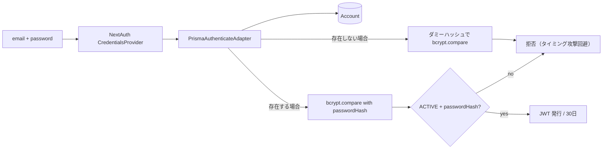
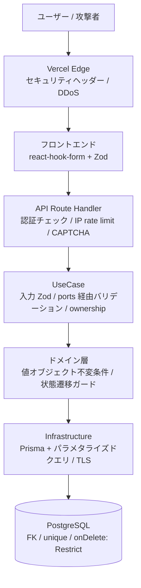

# 04. セキュリティ設計

PhysiFun のセキュリティ全体像を、認証・認可・データ保護・脅威モデル・防御層の俯瞰として整理する。

## このドキュメントの位置づけ

- **目的**: AI / 人間が「セキュリティに関する設計判断・防御層・脅威への対処」を一望する
- **正本**: コード・環境変数定義・next.config.ts。本書はその設計意図の集約
- **揮発度**: 中（脅威モデル変更・新規防御層追加のたびに更新）
- **関連**:
  - `02_domain-model.md` — Account / AdminAccount のアグリゲート分離
  - `03_data-model.md` — `onDelete: Restrict` などの整合性ルール
  - `05_key-flows/admin-magic-link.md` — Magic Link 認証の時系列
  - `05_key-flows/leader-application.md` — CAPTCHA / IP rate limit の時系列

---

## 1. 設計原則

| 原則 | 適用例 |
|---|---|
| **多層防御 (Defense in Depth)** | フロント Zod ≪ API バリデーション ≪ UseCase ドメイン制約 ≪ DB 制約の 4 段 |
| **fail-closed** | `ADMIN_MAGIC_LINK_HMAC_SECRET` 未設定 / 空値 / 同一値で起動拒否 |
| **最小権限** | Account には `SUPPORTER` ロールのみ自動付与。`LEADER` は運営承認後 |
| **アグリゲート分離** | `Account` と `AdminAccount` を **完全独立**（Cookie・セッション・Vercel・環境変数すべて分離） |
| **論理削除優先** | `AdminAccount` は物理削除しない (`status: DISABLED`)。監査履歴を保護 |
| **Constant-time 比較** | パスワード・HMAC・CRON_SECRET などすべての secret 比較 |
| **冪等性は呼び出し側責任** | Outbox はメッセージ重複の dedup を行わない（再送許容を前提に冪等設計） |

---

## 2. 認証アーキ

### 2.1 二系統の独立認証

| 観点 | `apps/web` (`Account`) | `apps/admin` (`AdminAccount`) |
|---|---|---|
| 対象ユーザ | 一般ユーザ（リーダー / サポーター） | 運営（数名想定） |
| プロバイダ | NextAuth `CredentialsProvider` | NextAuth `EmailProvider` (Magic Link) |
| 認証手段 | email + パスワード | メール内リンクのみ（パスワード持たない） |
| セッション戦略 | JWT | Database (`AdminSession` テーブル) |
| セッション TTL | 30 日 | 1 時間（固定・スライディング無し） |
| Cookie ドメイン | `<domain>` | `admin.<domain>` |
| Cookie 属性 | `HttpOnly` / `SameSite=lax` / HTTPS で `__Secure-` prefix | 同左（さらに host-only） |
| `NEXTAUTH_SECRET` | 値 A | 値 B（**必ず別値**） |
| Vercel プロジェクト | `web` | `admin`（別プロジェクト） |

> 💡 二系統に分離する理由: 運営は全データへのアクセス権を持つため**脅威モデルが根本的に異なる**。共通基盤に乗せると一方の脆弱性が他方に伝播するリスクが大きい。

### 2.2 web ユーザ認証（Credentials + JWT）



**実装ポイント:**

- **bcrypt cost = 10**（`packages/infrastructure/src/security/BcryptPasswordHasher.ts:17`）
- **`bcrypt.compare` は内部で constant-time 比較**（`BcryptPasswordHasher.ts:30`）
- **存在しない email でもダミーハッシュで `bcrypt.compare` を実行**（応答時間でユーザー存在を漏らさないため）
- **`ACTIVE` かつ `passwordHash` が non-null の Account のみログイン可能**（`PENDING_EMAIL_CONFIRMATION` は弾く）

### 2.3 運営認証（Magic Link + DB Session）

詳細シーケンスは `05_key-flows/admin-magic-link.md` 参照。要点だけ：

- **NextAuth EmailProvider** が `AdminVerificationToken`（24h TTL）を発行
- 加えて **HMAC-SHA256 で URL 自体に署名**（`sig` + `sig_exp` パラメータ、`ADMIN_MAGIC_LINK_HMAC_SECRET`）
- callback route で **NextAuth に渡す前に HMAC 検証**（署名 NG なら NextAuth ハンドラに到達させない）
- **`AdminPrismaAdapter` 内で `status: ACTIVE` のみログイン許可**
- **NextAuth `signIn` callback で AdminAccount 実在チェック**（未登録 email への送信を遮断 = open relay 対策）
- **Magic Link 送信のレート制限**: 5 回 / 15 分 / email
- **AdminSession 行を DELETE** すれば即座に強制 revoke（`apps/admin/src/lib/auth.ts:32-44`）

### 2.4 fail-closed の徹底

`apps/admin/src/lib/auth.ts:9-26` で起動時に以下を検証し、失敗で **throw**:

- `ADMIN_MAGIC_LINK_HMAC_SECRET` が未設定 / 空 / `NEXTAUTH_SECRET` と同値の場合
- ビルド時相当 (`NODE_ENV === "test"` / `NEXT_PHASE === "phase-production-build"`) はスキップ
- ランタイムでは `getAdminMagicLinkHmacSecret()` が都度呼ばれるので、起動時に通っても事後改変できない

---

## 3. 認可

### 3.1 ロールベース（web）

`Account.roles[]` で `Role` enum を保持（複数可）。

| ロール | 付与契機 | 権限 |
|---|---|---|
| `SUPPORTER` | アカウント発行時に自動付与 | Phase 1 では未活性。Phase 2 でサポート申請権限 |
| `LEADER` | 運営がリーダー応募を承認時に追加 | プロジェクト作成・編集・公開申請・自主取下げ・自主非公開 |

> ⚠️ `ADMIN` は `Role` enum に含まれない（`AdminAccount` 独立アグリゲート）。

### 3.2 オーナーシップ検証

プロジェクト系のすべての UseCase で実施:

```ts
if (project.ownerAccountId !== input.accountId) {
  return err({ type: "NOT_OWNER" });
}
```

これにより、URL を直接叩いて他人のプロジェクトを操作する攻撃を防ぐ。

### 3.3 運営認可

- `AdminAccount.status === "ACTIVE"` であることを **NextAuth Adapter / `signIn` callback / 各 UseCase でリピート検証**
- `AdminAccount.disable()` で **論理無効化**したアカウントは次回リクエスト時に弾かれる（DB セッションのため revoke が即座に効く）
- 認可レベルは現状フラット（`AdminAccount` は単一ロール）。複数権限レベルは Phase 2 で検討

### 3.4 件数上限の TOCTOU 対策

`PUBLISHED` 件数（3 件）は **承認トランザクション内で再カウント**（`05_key-flows/project-publish.md` §3.1）。アプリケーション層の事前チェックだけでは並行承認時に上限超過する可能性があるため。

---

## 4. データ保護

### 4.1 パスワード

| 項目 | 内容 |
|---|---|
| ハッシュアルゴリズム | bcrypt (`bcryptjs`) |
| cost factor | 10（推奨値、`BcryptPasswordHasher.DEFAULT_COST`） |
| 比較 | `bcrypt.compare` （内部で constant-time） |
| 平文保存 | 一切なし |
| 最小要件（アクティベート時） | 8 文字以上 + 英字 + 数字（`ActivateAccountUseCase.ts:57-102`） |

### 4.2 トークン管理

| トークン | 形式 | TTL | 保存先 | 再利用防止 |
|---|---|---|---|---|
| `Account.activationToken` | 32-byte hex（`crypto.randomBytes`） | 24 時間 | DB（平文） | 使用時に `NULL` クリア |
| `AdminVerificationToken.token` | UUID | 24 時間 | DB（平文） | 使用時に DELETE |
| Magic Link `sig` (HMAC) | hex 文字列 | 24 時間（`sig_exp`） | **DB に保存しない**（URL のみ） | 期限切れで失効 |
| `AdminSession.sessionToken` | UUID | 1 時間 | DB（平文） | DELETE で即時 revoke |
| JWT (web セッション) | NextAuth 署名 | 30 日 | Cookie | NEXTAUTH_SECRET の rotation で全 revoke |

> 💡 **HMAC 署名は DB に保存しない**意図的設計。漏洩経路を「URL（メール盗聴・スクショ）」のみに局限する。DB ダンプから `sig` を再構成できない。

### 4.3 暗号鍵・シークレット管理

| 環境変数 | 役割 | 注意点 |
|---|---|---|
| `NEXTAUTH_SECRET` (web) | JWT 署名 / Cookie 暗号化 | admin と**必ず別値** |
| `NEXTAUTH_SECRET` (admin) | DB セッション暗号化 / Cookie | web と**必ず別値**、`ADMIN_MAGIC_LINK_HMAC_SECRET` とも別値 |
| `ADMIN_MAGIC_LINK_HMAC_SECRET` | Magic Link URL 署名 | 未設定で起動拒否（fail-closed） |
| `CRON_SECRET` (web / admin) | Cron エンドポイント認可 | timingSafeEqual で比較 |
| `DATABASE_URL` | Supabase PostgreSQL 接続 | TLS 必須 |
| `SUPABASE_SERVICE_ROLE_KEY` | Storage 書き込み | サーバ側のみ。NEXT_PUBLIC で漏洩させない |
| `RESEND_API_KEY` | メール送信 | サーバ側のみ |
| `TURNSTILE_SECRET_KEY` | CAPTCHA siteverify | サーバ側のみ（フロントは `NEXT_PUBLIC_TURNSTILE_SITE_KEY`） |

すべて Vercel 環境変数で管理。`.env.local` は `.gitignore` 済み。

### 4.4 Constant-time 比較の使用箇所

| 比較対象 | ファイル | 関数 |
|---|---|---|
| パスワード ↔ bcrypt ハッシュ | `BcryptPasswordHasher.ts:33` | `bcrypt.compare` |
| Magic Link `sig` | `magicLinkHmac.ts:161` | `crypto.timingSafeEqual` |
| `CRON_SECRET` | `apps/admin/src/app/api/cron/gc-admin-auth/route.ts` | `crypto.timingSafeEqual`（Issue #159 L-2） |
| `CRON_SECRET` (web) | `apps/web/src/app/api/cron/process-outbox/route.ts:22-34` | `crypto.timingSafeEqual` |

> ⚠️ `timingSafeEqual` は **同一長**の Buffer のみで呼べる。長さ不一致は別 reason で先に弾く（`magicLinkHmac.ts:156`）。

---

## 5. 多層防御の俯瞰



| 層 | 主な責務 | 例 |
|---|---|---|
| **Edge** | セキュリティヘッダー、DDoS 緩和（Vercel デフォルト） | CSP / X-Frame-Options / HSTS（HTTPS 自動） |
| **Frontend** | UX としての validation | Zod スキーマ（送信前） |
| **API Route** | 認証 / IP rate limit / CAPTCHA / Zod 再検証 | `getServerSession` / `consume()` / Turnstile siteverify |
| **UseCase** | ビジネスルール / オーナーシップ / トランザクション境界 | `ownerAccountId !== accountId` の早期 return |
| **Domain** | 不変条件 / 状態遷移 / 値オブジェクトの正規化 | `Project.requestPublish()` の必須項目チェック |
| **Infrastructure** | Prisma による SQL injection 回避、TLS、env 読み込み | パラメタライズドクエリ（Prisma 標準） |
| **Database** | 整合性制約 | unique / FK / `onDelete: Restrict`（監査保護） |

各層が独立に検証することで、**1 層の脆弱性が認証バイパスに直結しない**設計を維持する。

---

## 6. 脅威モデル

### 6.1 想定する攻撃と対策

| 脅威 | 対策 | 残存リスク |
|---|---|---|
| **SQL Injection** | Prisma の parameterized query / Zod 入力検証 | なし（標準的） |
| **XSS** | React の自動エスケープ / CSP `script-src 'self'` + `'unsafe-inline'`（暫定） | `'unsafe-inline'` の暫定許可（Issue #109 follow-up） |
| **CSRF** | NextAuth の SameSite=lax Cookie / 状態変更は POST/PATCH/DELETE のみ | NextAuth デフォルト依存 |
| **Clickjacking** | `X-Frame-Options: DENY` + `frame-ancestors 'none'`（二重化） | なし |
| **Open Redirect** | NextAuth `callbackUrl` の同一オリジン検証 | NextAuth 依存 |
| **タイミング攻撃** | `bcrypt.compare` / `timingSafeEqual` / 存在しない email へのダミーハッシュ | URL 長さの差はわずかに残る（許容） |
| **Bot / スパム応募** | Cloudflare Turnstile + IP rate limit (3/h/IP) + duplicate email check | IP rate limit がインスタンス内 LRU（Phase 2 で Redis 化必須） |
| **メールボム** | 同上 + Outbox の冪等性（重複送信は許容、二重送信前提の文面） | `RATE_LIMIT_EXCEEDED` 経由で軽減 |
| **認証バイパス** | アグリゲート分離 / オーナーシップ検証 / `ACTIVE` チェックの多重化 | なし |
| **セッション盗難** | HttpOnly + Secure + SameSite Cookie / admin は 1h TTL / DB session で即時 revoke 可 | JWT (web) は 30 日。盗難時 NEXTAUTH_SECRET rotation のみ |
| **Magic Link 横取り** | URL 自体の HMAC 署名 / `sig_exp` 期限 / fail-closed | メール盗聴で 24h 以内クリック可（不可避） |
| **運営アカウント乗っ取り** | Magic Link のみ（パスワード盗難なし） / DB session 即時 revoke / 監査ログ | TOTP / 2FA は未実装（Phase 1 では運営数名前提） |
| **Activation token 再利用** | 使用時 `NULL` クリア / 24h TTL | 24h 以内なら盗聴で再現可（許容） |
| **管理者削除による監査喪失** | `onDelete: Restrict` で AdminAccount 物理削除を禁止 + `disable()` で論理削除 | 監査改ざんは AdminAuditLog の append-only 性で対処 |
| **Outbox 二重送信** | 5 分の claim タイムアウトで再 claim 許容 | 二重送信が起こり得る → 受信側冪等で対処 |
| **画像アップロードの濫用** | Supabase Storage の認証ポリシー / MIME / サイズ制限 | バケットレベル（`project-images`）で制御 |
| **CRON エンドポイント濫用** | `CRON_SECRET` Bearer + `timingSafeEqual` | secret 漏洩のみがリスク |
| **Open Relay (Magic Link)** | `signIn` callback で AdminAccount 実在検証 + 5/15min/email レート制限 | なし |

### 6.2 未対処（既知）

| 項目 | 状況 | 対応予定 |
|---|---|---|
| CSP `'unsafe-inline'` | Next.js App Router の暫定 | Issue #109 follow-up（nonce ベース移行） |
| IP rate limit のインスタンス分散 | LRU on memory（per instance） | Phase 2 で Redis / Vercel KV に置き換え（Issue #202） |
| 運営の TOTP / 2FA | 未実装 | 運営数増加時に検討（Phase 2+） |
| メール送信先の検証強化（DKIM / SPF） | Resend 側設定依存 | 本番ドメイン取得後に DNS 設定 |

---

## 7. ボット・スパム対策

### 7.1 Cloudflare Turnstile

- **適用箇所**: `POST /api/leader-applications`
- **siteverify** はサーバ側のみで実行（`apps/web/src/lib/captcha.ts`）
- 開発環境では `NODE_ENV !== "production"` でバイパス

### 7.2 IP レートリミット

| エンドポイント | リミット |
|---|---|
| `POST /api/leader-applications` | 3 回 / 1 時間 / IP |
| `POST /api/my/projects` | 10 回 / 10 分 / user |
| `PATCH /api/my/projects/:id` | 30 回 / 1 分 / user |
| `POST /api/my/projects/:id/{request-publish, withdraw, unpublish}` | 合算 10 回 / 1 分 / user |
| Admin Magic Link 送信 | 5 回 / 15 分 / email |

> ⚠️ 現実装は **インスタンス内 LRU**（`apps/web/src/lib/rateLimit.ts`）。Vercel の関数インスタンスをまたぐと共有されない。Phase 2 では Redis / KV ベースへの移行が必須（Issue #202）。

### 7.3 重複応募ブロック

`SubmitLeaderApplicationUseCase` は同じ email の Account が `PENDING_EMAIL_CONFIRMATION` または `ACTIVE` で存在する場合、`DUPLICATE_PENDING_APPLICATION` (409) で弾く。

---

## 8. 監査・観測性

### 8.1 AdminAuditLog

運営の操作ログを **append-only** で記録（`packages/infrastructure/prisma/schema.prisma:428-457`）。

| カラム | 役割 |
|---|---|
| `adminAccountId` | 操作者（`onDelete: Restrict`） |
| `adminSessionId` | セッション（`onDelete: SetNull`、セッション失効後も監査は残る） |
| `action` | `magic_link.signature_invalid` / `leader_application.approve` 等 |
| `targetType` / `targetId` | 操作対象 |
| `metadata` | 詳細 JSON |

複合インデックスを多数持ち、複数のクエリパターンに対応（`03_data-model.md` §8.1）:
- `(targetType, targetId)`: 特定エンティティの履歴
- `(action, createdAt)`: アクション × 時系列
- `(adminAccountId, createdAt)`: 運営別の履歴

### 8.2 ProjectReviewFeedback

公開審査の意思決定を残す（`02_domain-model.md` §3.4）。

- `action`: APPROVED / REJECTED / FORCE_UNPUBLISHED
- `note`: REJECTED / FORCE_UNPUBLISHED は必須
- `reviewerId`: `onDelete: Restrict` で運営アカウントを物理削除から保護

### 8.3 Outbox の dead-letter 監視

`deadLetteredAt IS NOT NULL` のメッセージは手動対応が必要。`apps/admin/src/app/outbox/` に運営向けダッシュボードあり。

### 8.4 onDelete: Restrict の意図

`AdminAccount` を物理削除すると以下の監査が失われる:

- 過去のリーダー応募審査者
- 過去のプロジェクト公開承認者・差戻者・強制非公開実行者
- AdminAuditLog の操作者
- ProjectReviewFeedback の作成者

→ `Restrict` で禁止し、退職運用は `disable()` で論理無効化する。

---

## 9. セキュリティヘッダー（CSP / その他）

`apps/web/next.config.ts` および `apps/admin/next.config.ts` で全レスポンスに付与。

| ヘッダー | 値 | 意図 |
|---|---|---|
| `Content-Security-Policy` | （後述） | XSS 軽減 / リソース制限 |
| `X-Frame-Options` | `DENY` | clickjacking 対策（CSP `frame-ancestors 'none'` と二重化） |
| `X-Content-Type-Options` | `nosniff` | MIME sniffing 阻止 |
| `Referrer-Policy` | `strict-origin-when-cross-origin` | URL 漏洩防止 |
| `Permissions-Policy` | accelerometer / autoplay / camera / 等を `()` | 不要な Web Platform Feature の無効化 |

### 9.1 CSP の主なディレクティブ（web）

| Directive | 値 |
|---|---|
| `default-src` | `'self'` |
| `frame-ancestors` | `'none'` |
| `object-src` | `'none'` |
| `img-src` | `'self' data: blob: https://*.supabase.co https://images.unsplash.com` |
| `style-src` | `'self' 'unsafe-inline'` |
| `script-src` | `'self' 'unsafe-inline'`（本番、Issue #109 follow-up で nonce 化予定） |
| `connect-src` | `'self'` |

詳細は `apps/web/next.config.ts:37-103` 参照。

### 9.2 admin 側の追加設定

`apps/admin/src/lib/auth.ts:60-78` で Cookie 設定を強化:

- `__Secure-next-auth.session-token` プレフィックス（HTTPS 必須）
- `httpOnly: true`
- `sameSite: "lax"`（Magic Link の戻り遷移を許可）
- `domain: undefined`（host-only Cookie で親ドメイン漏れを防止）

---

## 10. 環境変数とシークレット運用

### 10.1 起動時検証（fail-closed）

| 環境変数 | 検証ロジック |
|---|---|
| `ADMIN_MAGIC_LINK_HMAC_SECRET` | 未設定 / 空 / `NEXTAUTH_SECRET` と同値で起動拒否 |
| `NEXTAUTH_SECRET` | NextAuth v4 が起動時に検証（本番 production のみ） |
| `CRON_SECRET` | 未設定なら **Cron エンドポイントは常に拒否** |

### 10.2 シークレットローテーション

| 対象 | 影響範囲 | 手順 |
|---|---|---|
| `NEXTAUTH_SECRET` (web) | 全 JWT セッション失効（再ログイン） | Vercel で値変更 → 全ユーザに再ログイン |
| `NEXTAUTH_SECRET` (admin) | 全 AdminSession 失効（DB セッション） | 同上＋必要なら AdminSession を DELETE |
| `ADMIN_MAGIC_LINK_HMAC_SECRET` | 既存 Magic Link が即時失効 | リンク送信中の運営に再送信を依頼 |
| `CRON_SECRET` | Cron が一時停止 | 値変更 → Vercel Cron 設定も同時更新 |
| `DATABASE_URL` パスワード | DB アクセス即停止 | 計画的なメンテ枠で実施 |
| `RESEND_API_KEY` | メール送信即停止 | 新キー発行 → Vercel 更新 |

### 10.3 開発環境での扱い

- `.env.local` は `.gitignore` 済み（`.env.example` のみ git 管理）
- ローカル Supabase の credentials は `make status` で確認可能（local 限定）
- 本番秘匿値はローカルで使用しない方針（事故防止）

---

## 11. データ削除・GDPR 系の検討（メモ）

| 項目 | Phase 1 状況 | Phase 2 で検討 |
|---|---|---|
| ユーザのアカウント削除リクエスト | 未実装 | UI 提供と Cascade 連鎖の影響範囲を評価 |
| `Account` 物理削除時の関連削除 | Cascade 設定済み（`LeaderApplication` / `Project`） | サポートチケット (`SupportTicket.supporterAccountId`) は Restrict のため別運用が必要 |
| データエクスポート | 未実装 | プロジェクト・応募・サポートチケットの個別エクスポート画面検討 |
| 72 時間自動削除（PENDING） | 実装済み（`CleanupExpiredPendingAccountsUseCase`） | — |
| Outbox メッセージの保持期間 | 永続（dead-letter も残る） | 本番ボリューム次第で archival 戦略 |

---

## 12. 既知の Phase 1 残課題（セキュリティ関連）

| 項目 | 概要 | 対応 |
|---|---|---|
| CSP `'unsafe-inline'` 暫定許可 | Next.js App Router のインラインスクリプト対応 | Issue #109 follow-up（nonce middleware） |
| IP rate limit インスタンス分散 | LRU on memory | Issue #202（Redis / KV 移行） |
| 運営 TOTP / 2FA | 未実装 | 運営増加時 / Phase 2 |
| 監査ログのアラート | dashboard のみ | Phase 2 で異常検知 |
| メール DKIM/SPF | Resend デフォルト依存 | 本番ドメイン取得後 |

---

## 13. 改訂履歴

| 日付 | 改訂内容 | 担当 |
|---|---|---|
| 2026-05-09 | 初稿作成（認証・認可・データ保護・脅威モデル・セキュリティヘッダー・運用） | 設計チーム |
