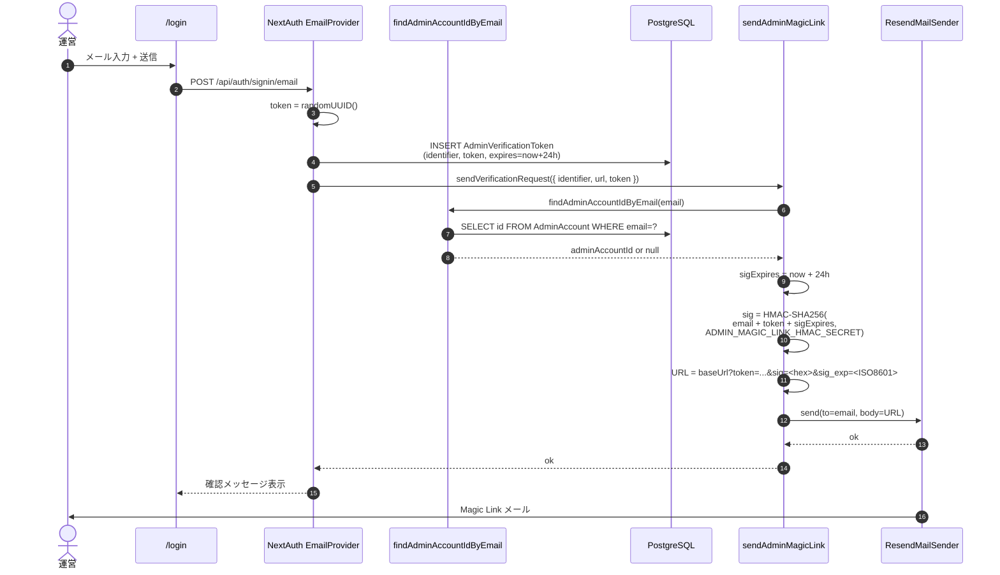
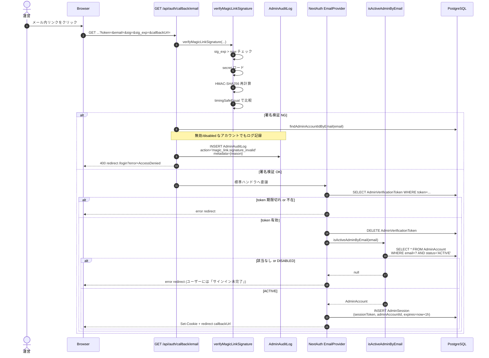
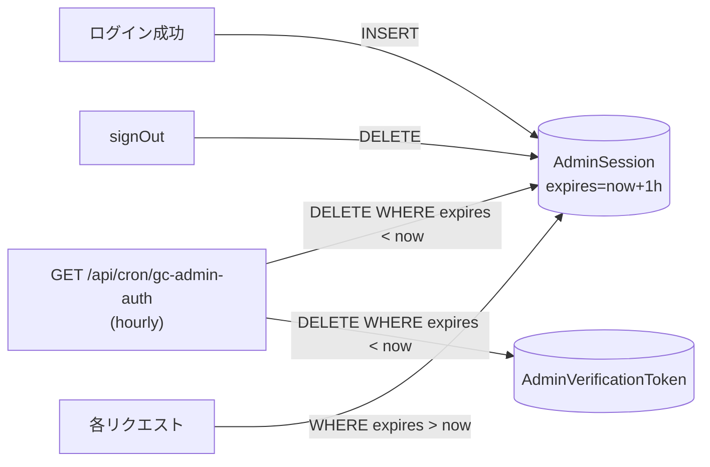

# フロー：運営 Magic Link 認証

`apps/admin` のログインフロー。NextAuth EmailProvider + HMAC 署名 + DB セッションで構成される。

## 関連コード

- ログインページ: `apps/admin/src/app/login/page.tsx`
- NextAuth: `apps/admin/src/app/api/auth/[...nextauth]/route.ts`
- HMAC: `packages/infrastructure/src/admin-account/sendAdminMagicLink.ts` / `verifyMagicLinkSignature.ts`
- AdminAccount lookup: `packages/infrastructure/src/admin-account/isActiveAdminByEmail.ts` / `findAdminAccountIdByEmail.ts`
- セッション GC: `apps/admin/src/app/api/cron/gc-admin-auth/route.ts`

---

## 1. なぜこの設計か（要点）

| 設計判断 | 理由 |
|---|---|
| **メール経由のみ**（パスワード持たない） | 運営アカウントの数が少なく、パスワード運用コストを避けたい |
| **DB セッション + 1h TTL** | JWT より revoke が確実。短い TTL で漏洩リスクを抑える |
| **HMAC URL 署名（独自上乗せ）** | NextAuth 標準の token に加えて、URL 自体を改ざん検知。フィッシング・インジェクション耐性向上 |
| **物理削除しない AdminAccount** | 監査履歴を保護（`status: DISABLED` で論理無効化） |
| **`AdminAccount` を `Account` と分離** | 認証手段・脅威モデル・Cookie が完全に異なるため独立アグリゲートとして管理 |

詳細は `04_security-design.md`（作成予定）参照。

---

## 2. Magic Link 送信フェーズ

**ポイント:**

- `AdminVerificationToken` は **NextAuth の標準テーブル**（24h TTL）
- `sig` / `sig_exp` は NextAuth とは独立した上乗せ署名。`ADMIN_MAGIC_LINK_HMAC_SECRET` が未設定だと**起動拒否**（`tech.md` 参照）
- 存在しないメールアドレスでも 200 を返す（**ユーザー存在の漏洩防止**）。実際の検証はリンククリック時に行う

---

## 3. Magic Link 検証フェーズ

---

## 4. セッション TTL とクリーンアップ

- **AdminSession**: TTL = 1 時間（**スライディングしない固定値**）
- **AdminVerificationToken**: TTL = 24 時間
- **GC Cron**: 期限切れの両方を削除。`CRON_SECRET` を `timingSafeEqual()` で検証（Issue #159 L-2）

> ⚠️ 1 時間 TTL は固定値で延長されない。長時間の運営作業中にセッションが切れる可能性あり（再ログインで継続）。

---

## 5. 状態変化サマリ

| イベント | テーブル | 変更 |
|---|---|---|
| メール入力 | `AdminVerificationToken` | INSERT (identifier, token, expires=+24h) |
| リンククリック・署名検証 NG | `AdminAuditLog` | INSERT action=`magic_link.signature_invalid` |
| リンククリック・成功 | `AdminVerificationToken` | DELETE（消費済み） |
| リンククリック・成功 | `AdminSession` | INSERT (sessionToken, expires=+1h) |
| GC Cron | `AdminVerificationToken` / `AdminSession` | 期限切れを DELETE |
| signOut | `AdminSession` | DELETE |

---

## 6. エラーパス整理

| 失敗 | 動作 | 監査ログ |
|---|---|---|
| メール形式不正 | NextAuth 400 | なし |
| 該当 AdminAccount なし | 200 (送信フェーズ) / リンク後 NextAuth がトークンは作るがログイン不可 | なし |
| `status: DISABLED` のアカウント | 同上 | なし（送信） / `magic_link.signature_invalid` あり得る（後段検証で） |
| HMAC `sig` 不一致 | 400 redirect `/login?error=AccessDenied` | あり (`reason="sig_mismatch"`) |
| `sig_exp` 期限切れ | 400 redirect | あり (`reason="sig_exp_invalid"`) |
| `ADMIN_MAGIC_LINK_HMAC_SECRET` 未設定 | 400 redirect (fail-closed) | あり (`reason="secret_unavailable"`) |
| `AdminVerificationToken` 期限切れ・既消費 | NextAuth エラーリダイレクト | なし |

> 💡 **disabled アカウントの失敗もログを残す**: 元運営者の権限再開試行などが追跡できる。

---

## 7. 設計上のポイント・注意事項

### 7.1 HMAC は DB に保存しない

`sig` は URL に含めて送るが、DB には保存しない。漏洩リスクを「URL 経路（メール盗聴・スクショ）」のみに局限する。

### 7.2 fail-closed の徹底

- `ADMIN_MAGIC_LINK_HMAC_SECRET` が未設定なら**起動拒否**
- `sig_exp` が読めないなら拒否
- 検証中に例外が出たら拒否（catch して fallthrough しない）

### 7.3 timingSafeEqual の使用

- HMAC 比較
- CRON_SECRET 比較

両方ともタイミング攻撃を避けるため `crypto.timingSafeEqual()`（または同等の constant-time 関数）を使用。

### 7.4 NextAuth ハンドラを呼ぶ前に署名検証

`/api/auth/callback/email` を **route handler でインターセプト**して、NextAuth に渡す前に HMAC を検証する。署名 NG なら NextAuth ハンドラに到達させない（NextAuth のエラー応答を経由すると挙動が読みづらいため）。

### 7.5 `Account` (web) との完全分離

| 項目 | apps/web (`Account`) | apps/admin (`AdminAccount`) |
|---|---|---|
| 認証方式 | Credentials (email + password) | EmailProvider (Magic Link) |
| セッション | JWT (30 日) | Database (1 h) |
| Cookie ドメイン | `<domain>` | `admin.<domain>`（サブドメイン分離） |
| `NEXTAUTH_SECRET` | 値 A | 値 B（**必ず別値**） |
| 環境変数 | `apps/web/.env.local` | `apps/admin/.env.local` |
| Vercel プロジェクト | `web` | `admin`（別プロジェクト） |

ドメイン層も `Account` と `AdminAccount` は独立アグリゲート。`02_domain-model.md` §6 参照。

### 7.6 セキュリティ詳細

脅威モデル・防御層の俯瞰は `04_security-design.md`（作成予定）に集約する予定。
