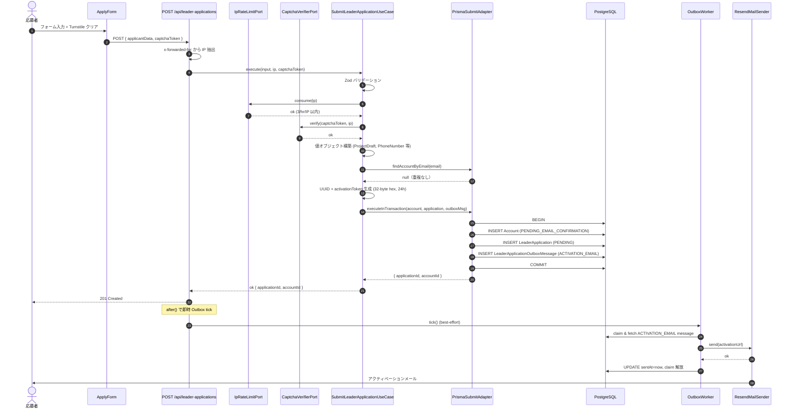
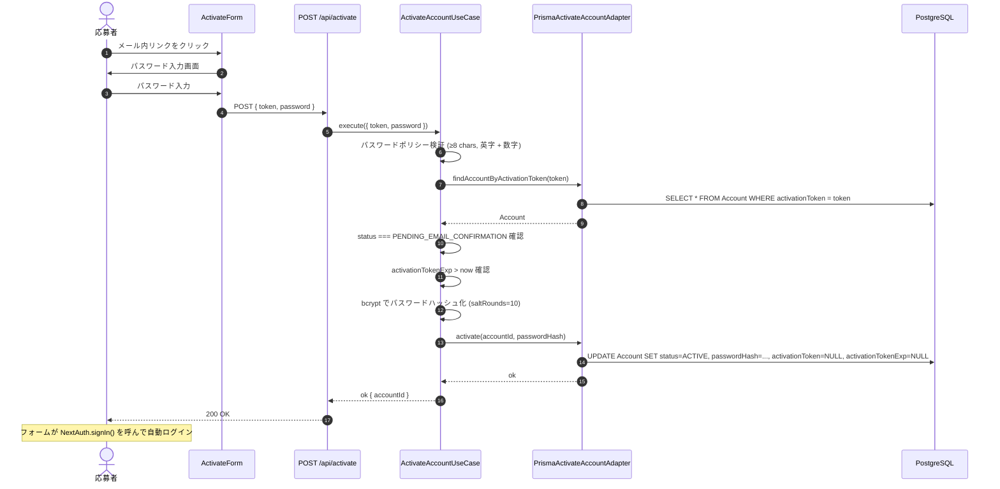
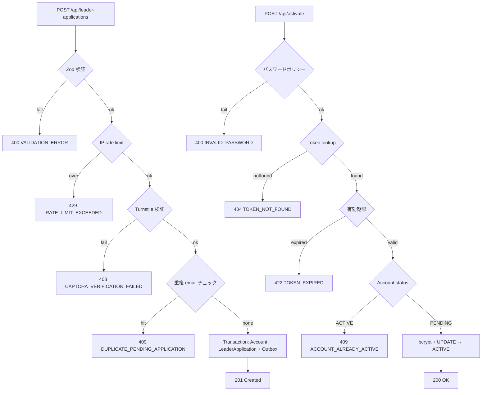

# フロー：リーダー応募 → アクティベート

`/apply` フォーム送信から、Account が `ACTIVE` 化してログイン可能になるまでの流れ。

## 関連コード

- API Route: `apps/web/src/app/api/leader-applications/route.ts`
- API Route: `apps/web/src/app/api/activate/route.ts`
- UseCase: `packages/application/src/leader-application/SubmitLeaderApplicationUseCase.ts`
- UseCase: `packages/application/src/account/ActivateAccountUseCase.ts`
- Adapter: `packages/infrastructure/src/leader-application/PrismaSubmitLeaderApplicationAdapter.ts`
- 補助: `apps/web/src/lib/captcha.ts` (Cloudflare Turnstile) / `apps/web/src/lib/rateLimit.ts` (LRU)
- Outbox: `packages/infrastructure/src/outbox/processors/ActivationEmailProcessor.ts`

---

## 1. ハッピーパス（送信→アクティベートまで）

> 💡 `after()` でのインライン送信が失敗しても、Vercel Cron による定期トリガーで再試行される（**A 経路と B 経路の二重化**、詳細は `outbox-mail.md` 参照）。

---

## 2. ハッピーパス（リンククリック→ ACTIVE まで）

---

## 3. 状態変化サマリ

| 操作 | テーブル | 主な変更 |
|---|---|---|
| 応募送信 | `Account` | INSERT: status=`PENDING_EMAIL_CONFIRMATION`, roles=[`SUPPORTER`], activationToken, activationTokenExp |
| 応募送信 | `LeaderApplication` | INSERT: status=`PENDING`, projectDraft 一式, submittedAt |
| 応募送信 | `LeaderApplicationOutboxMessage` | INSERT: type=`ACTIVATION_EMAIL`, payload={accountId, email, activationToken, displayName} |
| メール送信成功 | `LeaderApplicationOutboxMessage` | UPDATE: sentAt=now, claimedAt/claimedBy=null |
| アクティベート | `Account` | UPDATE: status=`ACTIVE`, passwordHash, activationToken=null, activationTokenExp=null |

---

## 4. エラーパス

### 応募送信時

| エラー型 | HTTP | 発生条件 | レスポンス補足 |
|---|---|---|---|
| `VALIDATION_ERROR` | 400 | Zod スキーマ違反 | フィールド別エラー配列 |
| `RATE_LIMIT_EXCEEDED` | 429 | IP あたり 3 回 / 1 時間を超過 | `Retry-After`, `X-RateLimit-*` ヘッダー付与 |
| `CAPTCHA_VERIFICATION_FAILED` | 403 | Turnstile siteverify が `success: false` | — |
| `DUPLICATE_PENDING_APPLICATION` | 409 | 同 email の Account が `PENDING_EMAIL_CONFIRMATION` または `ACTIVE` で存在 | — |

### アクティベート時

| エラー型 | HTTP | 発生条件 |
|---|---|---|
| `INVALID_PASSWORD` | 400 | 8 文字未満 / 英字なし / 数字なし |
| `TOKEN_NOT_FOUND` | 404 | `activationToken` 一致 Account なし |
| `TOKEN_EXPIRED` | 422 | `activationTokenExp < now`（24h 超過） |
| `ACCOUNT_ALREADY_ACTIVE` | 409 | Account が既に `ACTIVE` |

---

## 5. 設計上のポイント・注意事項

### 5.1 IP rate limit の限界

`apps/web/src/lib/rateLimit.ts` の `LRU` バケットは **インスタンス内メモリ**。Vercel の関数インスタンスをまたぐと共有されない。Phase 1 はトラフィックが少ないため許容しているが、**Phase 2 では Redis / Vercel KV ベースに置き換える必要あり**（Issue #202）。

### 5.2 アクティベーショントークンの再利用攻撃

`activate()` 成功時に `activationToken` は `NULL` にクリアされる。古いリンクを再度クリックすると `TOKEN_NOT_FOUND` を返す。**強制的な revoke はしていない**ので、メール盗聴で 24h 以内にクリックされる可能性は残る（このリスクは admin-side magic link と同等）。

### 5.3 Email の正規化

Zod スキーマで `.trim().toLowerCase()` が適用される。Adapter / 重複チェック / Outbox のメール送信先すべてが**小文字 email** で動作する。

### 5.4 Outbox による即時トリガーは best-effort

API Route の `after()` callback で `Worker.tick()` を呼ぶが、**失敗しても 201 レスポンスには影響しない**。Cron による A 経路がフォールバックになる。詳細は `outbox-mail.md` 参照。

### 5.5 ProjectDraft の Snapshot 性

`LeaderApplication.projectDraft` は応募時点のスナップショット。承認後に `Project` を新規作成しても、`ProjectDraft` は不変。詳細は `02_domain-model.md` §4.3 参照。

### 5.6 Zod スキーマがフィールド制約の SSoT

応募フォームの文字数上限・正規表現は `apps/web/src/components/apply/...` の Zod スキーマと、`packages/domain/src/leader-application/value-objects/ProjectDraft.ts` の値オブジェクト検証、`packages/infrastructure/prisma/schema.prisma` の DB 制約が **3 重に並ぶ**。手動で同期する。
