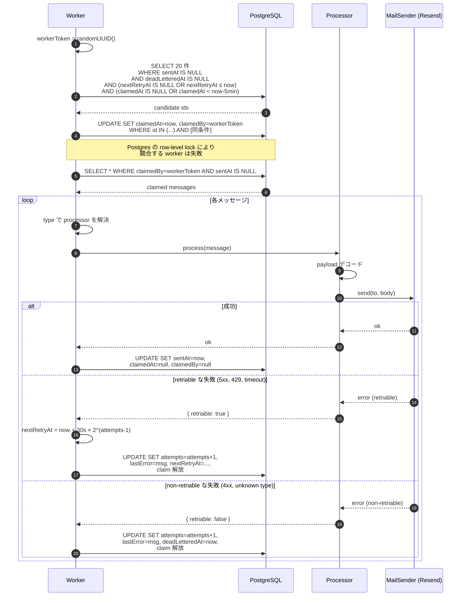
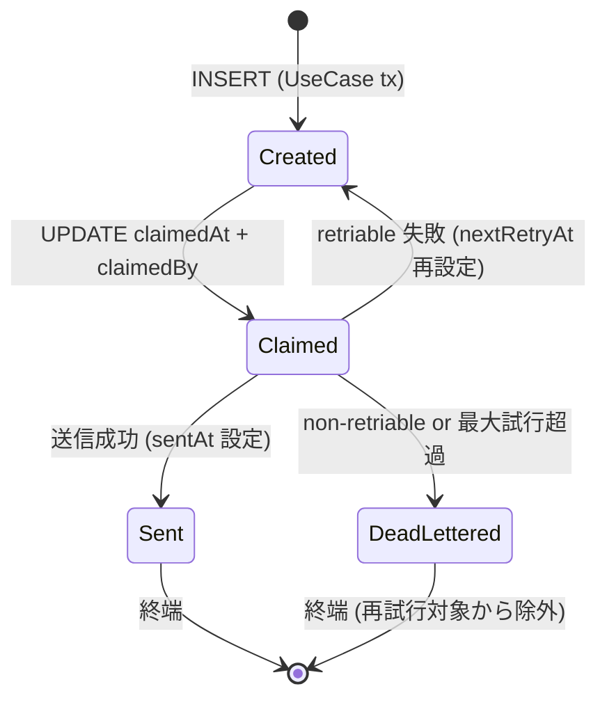
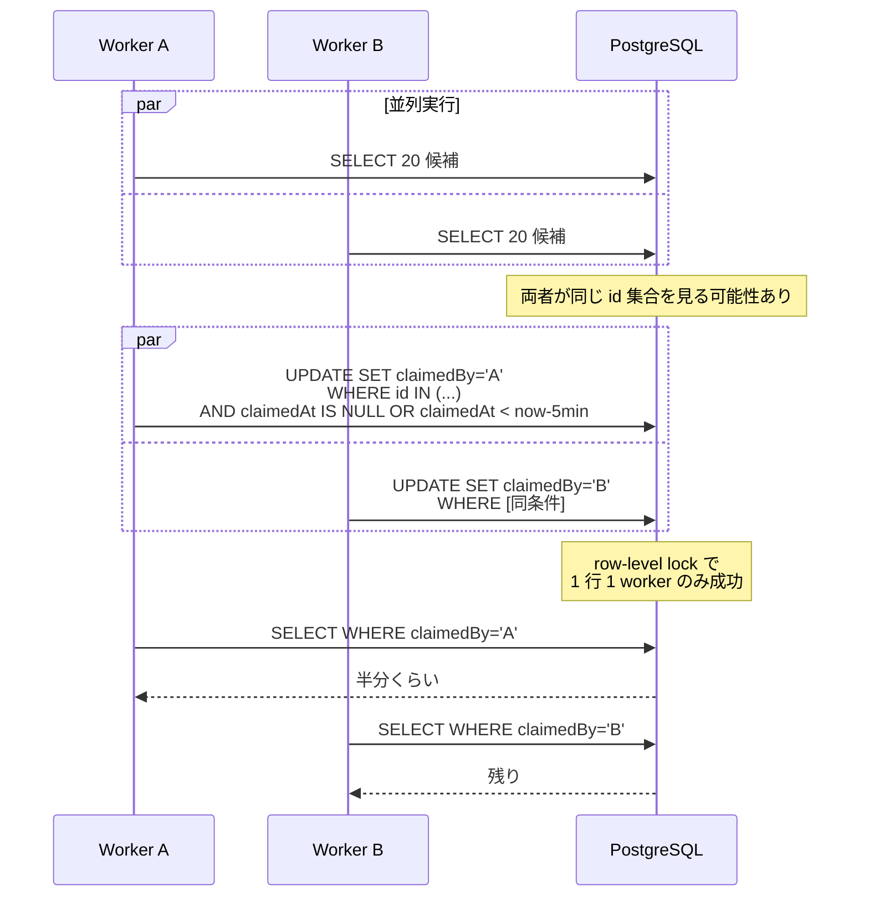
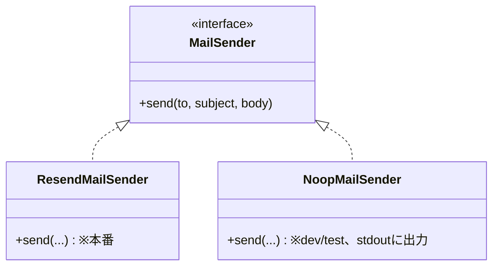

# フロー：Outbox メール送信

PhysiFun は **Outbox パターン**で非同期メール送信を実装している。本書は worker の動作・リトライ・dead-letter・メッセージタイプ対応を整理する。

## 関連コード

- ベース: `packages/infrastructure/src/outbox/OutboxWorkerBase.ts`
- ワーカー: `LeaderApplicationOutboxWorker` / `ProjectOutboxWorker`
- プロセッサ: `packages/infrastructure/src/outbox/processors/`
- メール送信: `packages/infrastructure/src/mail/{ResendMailSender, NoopMailSender}.ts`
- Cron Route: `apps/web/src/app/api/cron/process-outbox/route.ts`
- データモデル: `LeaderApplicationOutboxMessage` / `ProjectOutboxMessage`（`03_data-model.md` §5 参照）

---

## 1. なぜ Outbox パターンか

| 動機 | 効果 |
|---|---|
| DB 書き込みとメール送信の**原子性** | UseCase のトランザクション内に Outbox INSERT を含めることで「DB は更新できたがメールは飛ばなかった / 逆」を防ぐ |
| 失敗時のリトライ | 送信失敗を `attempts` / `nextRetryAt` で追跡し、ワーカーが自動リトライ |
| 並行処理の安全性 | claim 機構（`claimedAt` / `claimedBy`）で複数ワーカーが同じメッセージを処理しない |
| 監視・dead-letter | 最大リトライ超過後の dead-letter で、永久に送れないメッセージを可視化 |

---

## 2. メッセージタイプ → プロセッサ対応表

| メッセージタイプ | テーブル | プロセッサ | 送信先 |
|---|---|---|---|
| `ACTIVATION_EMAIL` | `LeaderApplicationOutboxMessage` | `ActivationEmailProcessor` | 応募者 (Account.email) |
| `approved.notify_applicant` | `LeaderApplicationOutboxMessage` | `LeaderApplicationApprovedNotifyProcessor` | 応募者 |
| `rejected.notify_applicant` | `LeaderApplicationOutboxMessage` | `LeaderApplicationRejectedNotifyProcessor` | 応募者（理由付き） |
| `admin_publish_request.notify` | `ProjectOutboxMessage` | `AdminPublishRequestNotifyProcessor` | `ADMIN_EMAIL_LIST` の先頭 |
| `project_publish_approved.notify` | `ProjectOutboxMessage` | `ProjectPublishApprovedNotifyProcessor` | リーダー |
| `project_publish_rejected.notify` | `ProjectOutboxMessage` | `ProjectPublishRejectedNotifyProcessor` | リーダー（理由付き） |
| `project_force_unpublished.notify` | `ProjectOutboxMessage` | `ProjectForceUnpublishedNotifyProcessor` | リーダー（理由付き） |

> 💡 **Outbox テーブルが 2 種類に分かれている**理由: `LeaderApplication` と `Project` のアグリゲートが異なるため、それぞれ独自の Outbox を持つ（共通基底テーブルの過剰抽象化を避けた）。詳細は `03_data-model.md` §5 参照。

---

## 3. 起動経路（A 経路 / B 経路）

```mermaid
flowchart LR
    UseCase[UseCase 実行] -->|tx commit| Outbox[(OutboxMessage)]
    UseCase -->|after\(\) コールバック| BPath["B: 即時 tick (best-effort)"]
    Cron["Vercel Cron<br/>/api/cron/process-outbox"] -->|定期| APath["A: 定期 tick"]
    BPath --> Worker
    APath --> Worker
    Worker[OutboxWorker.tick] --> Outbox
```

| 経路 | 起動契機 | 用途 |
|---|---|---|
| **A 経路** | Vercel Cron `/api/cron/process-outbox` | 定期処理。Hobby プランは daily、Pro プランは 1 分間隔推奨 |
| **B 経路** | Next.js `after()` コールバック | UseCase 直後の即時 tick。**ベストエフォート**で、失敗してもクライアントには伝わらない |

> 💡 B 経路のおかげで通常時は数秒以内に送信される。A 経路は **B 経路が失敗した場合のリカバリ**として機能する。

---

## 4. ワーカーの 1 tick



---

## 5. メッセージのライフサイクル



**主な制約:**

- **claim タイムアウト = 5 分**: ワーカーがクラッシュして claim を解放しなかった場合、5 分後に他のワーカーが再 claim 可能
- **最大試行回数 = 10**（デフォルト）: 超えると dead-letter
- **Exponential backoff**: `nextRetryAt = now + 30s × 2^(attempts-1)`
  - 試行 1 → 30 秒後
  - 試行 2 → 60 秒後
  - 試行 3 → 120 秒後
  - ...
  - 試行 10 → dead-letter

---

## 6. claim 機構の詳細

### 6.1 競合状態への対処

複数ワーカーが同時に tick した場合：



> 💡 **これは分散ロックではない**。Postgres の row-level lock + WHERE 条件の atomic update に依存している。Vercel の同 region 内では十分に動作する。

### 6.2 ワーカークラッシュ時のリカバリ

claim したワーカーが処理中にクラッシュ（OOM・関数タイムアウトなど）した場合、`claimedAt` が古いままになる。

→ **claim 期限 5 分**を超えると、次の tick で他のワーカーが再 claim できる（同じメッセージが二度処理される可能性あり、**冪等性は呼び出し側責任**）。

---

## 7. メール送信実装の差し替え



| 環境 | 実装 | 動作 |
|---|---|---|
| 本番 | `ResendMailSender` | Resend API へ送信。`RESEND_API_KEY` 必須 |
| 開発 / CI | `NoopMailSender` | stdout にログ出力のみ。実際の送信なし |

---

## 8. エラー分類

### 8.1 Retriable

| 種類 | 例 |
|---|---|
| 5xx サーバーエラー | Resend `503 Service Unavailable` |
| 429 Too Many Requests | レート制限 |
| timeout | ネットワーク切断・関数タイムアウト |

→ `attempts` 加算 + `nextRetryAt` 設定で次回リトライ。

### 8.2 Non-retriable

| 種類 | 例 |
|---|---|
| 4xx バリデーション | 不正なメールフォーマット |
| Unknown message type | プロセッサが見つからない（コードと DB の不整合） |
| 致命的な payload 不正 | 必須フィールド欠落 |

→ 即座に `deadLetteredAt` 設定（リトライ無し）。

---

## 9. 設計上のポイント・注意事項

### 9.1 二重送信のリスク

ワーカークラッシュ後の 5 分タイムアウトでの再 claim では、**メッセージが 2 回処理される可能性**がある。Resend 側で同一メールを 2 回送ってしまう。

→ **冪等性は宛先側で担保**する想定（同一トークンのリンクが 2 通来ても、ユーザーは同じものとして処理できる）。**メール内に「2 回届いた場合は無視してください」の注記を入れない**設計選択は意図的。

### 9.2 dead-letter の監視

`deadLetteredAt IS NOT NULL` のメッセージは**手動対応が必要**。Phase 1 では運営アプリのダッシュボードに表示する画面が整備されている（`apps/admin/src/app/outbox/`）。

### 9.3 `after()` の実行タイミング

Next.js の `after()` は **クライアントへのレスポンス送信後**に実行される。失敗してもクライアントには影響しない反面、**CPU/IO リソースは Vercel 関数の実行時間にカウントされる**。Hobby プランで実行時間が短い場合、tick が途中で打ち切られることがあり得る → A 経路（cron）でリカバリ。

### 9.4 2 つの Worker を並列実行

Cron Route は `LeaderApplicationOutboxWorker` と `ProjectOutboxWorker` を **`Promise.allSettled` 風に並列実行**する。片方が失敗してももう片方は進む。レスポンスは 200（両方成功） or 500（少なくとも片方が uncaught throw）+ `failedTicks` 配列で返す。

### 9.5 メッセージの dedup は無し

同じ payload で 2 回 INSERT すれば 2 メッセージ独立に処理される。重複防止は呼び出し側責任（UseCase が「既に Outbox に同じものが無いか」をチェックする等）。Phase 1 ではアグリゲートの状態遷移と Outbox INSERT が同一 transaction なので、業務的にはほぼ問題ない。

### 9.6 リトライ間隔・最大回数の調整

`OutboxWorkerBase` のデフォルトは「30 秒 × 2^n」「最大 10 回」。プロセッサ実装で上書き可能。Phase 2 で SLA に応じて調整する。
