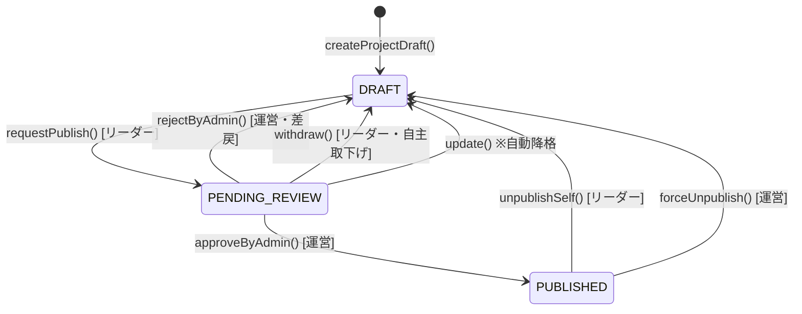
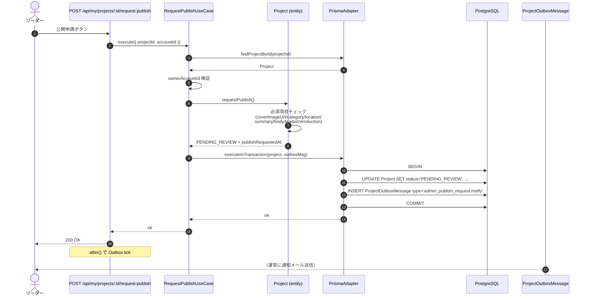
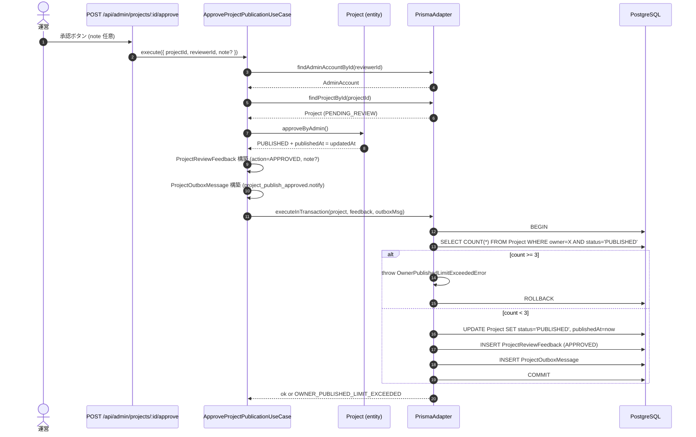
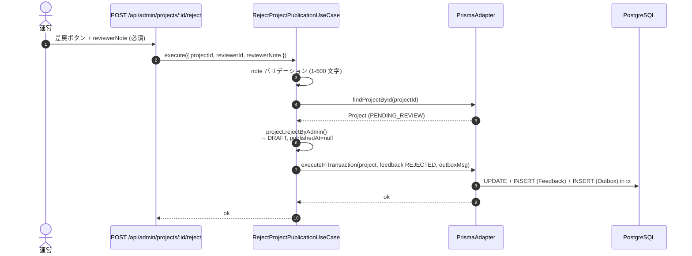
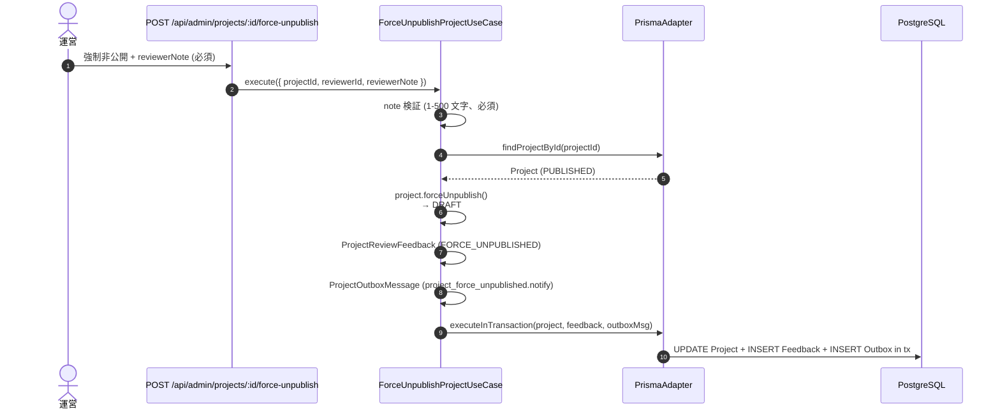
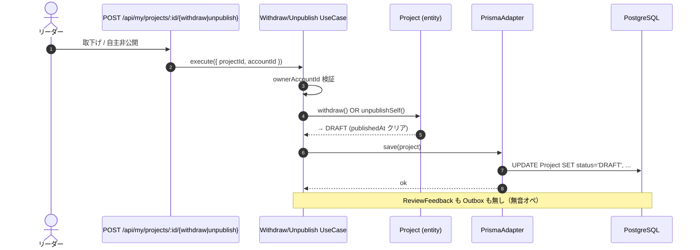
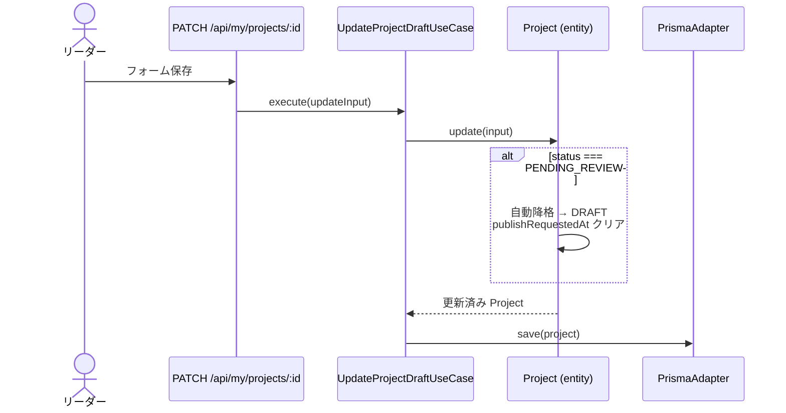

# フロー：プロジェクト公開審査

`Project.publishStatus` の状態遷移を起点に、リーダー側操作と運営側操作のシーケンスを整理する。

## 関連コード

リーダー側 (web):
- `RequestPublishUseCase` / `WithdrawProjectUseCase` / `UnpublishProjectUseCase` / `UpdateProjectDraftUseCase`
- API Route: `apps/web/src/app/api/my/projects/[projectId]/...`

運営側 (admin):
- `ApproveProjectPublicationUseCase` / `RejectProjectPublicationUseCase` / `ForceUnpublishProjectUseCase`
- API Route: `apps/admin/src/app/api/admin/projects/[projectId]/...`

ドメイン:
- `packages/domain/src/project/entities/Project.ts`（状態遷移メソッド）
- `packages/domain/src/project/entities/ProjectReviewFeedback.ts`（監査）

---

## 1. 状態遷移の俯瞰

**監査記録（`ProjectReviewFeedback`）が作成される操作:**

| 操作 | `ReviewAction` | `note` 必須 |
|---|---|---|
| `approveByAdmin()` | `APPROVED` | 任意 |
| `rejectByAdmin()` | `REJECTED` | 必須 |
| `forceUnpublish()` | `FORCE_UNPUBLISHED` | 必須 |
| `withdraw()` / `unpublishSelf()` | （記録なし） | — |

---

## 2. 公開申請（リーダー）

エラー型: `NOT_OWNER` (403) / `PROJECT_NOT_FOUND` (404) / `INVALID_PROJECT_STATUS` (422、必須項目不足など) / `MISSING_REQUIRED_FIELDS` (422)。

---

## 3. 運営承認・差戻

### 3.1 承認

> 💡 **3 件上限の TOCTOU 対策**: ユーザーごとの `PUBLISHED` 件数チェックを**トランザクション内**で実施。複数の `PENDING_REVIEW` を同時承認しようとしても、最初の 1 件だけが成功する。

### 3.2 差戻（reject）

エラー型（reject / approve 共通）: `REVIEWER_NOT_FOUND` (401) / `REVIEWER_NOTE_REQUIRED` (400) / `REVIEWER_NOTE_TOO_LONG` (400) / `OWNER_PUBLISHED_LIMIT_EXCEEDED` (409、approve のみ) / `INVALID_PROJECT_STATUS` (422) / `PROJECT_NOT_FOUND` (404)。

---

## 4. 強制非公開（運営）

> 💡 強制非公開は `PUBLISHED` 限定。`PENDING_REVIEW` には使えない（差戻で対応）。

---

## 5. リーダー自主取下げ・自主非公開

> 💡 リーダー側の自主操作は**監査記録もメール通知も発生しない**。運営側は気づきにくいので、必要なら別途ダッシュボードに「取下げ・自主非公開の最近の発生数」を出すなどの設計検討が必要。

---

## 6. 編集による自動降格

`PENDING_REVIEW` 状態で `update()` が呼ばれると、**自動的に `DRAFT` へ降格**して再申請が必要になる。

> 💡 これは仕様（Issue #78）。「申請後の編集は再申請が必要」という運用ルールを実装に焼き付けている。

---

## 7. Outbox メッセージタイプ対応

| 操作 | メッセージタイプ | 通知先 |
|---|---|---|
| `requestPublish()` | `admin_publish_request.notify` | `ADMIN_EMAIL_LIST` の先頭 |
| `approveByAdmin()` | `project_publish_approved.notify` | リーダー (Account.email) |
| `rejectByAdmin()` | `project_publish_rejected.notify` | リーダー (理由付き) |
| `forceUnpublish()` | `project_force_unpublished.notify` | リーダー (理由付き) |
| `withdraw()` / `unpublishSelf()` | （なし） | — |

メッセージテーブルは `ProjectOutboxMessage`。詳細は `outbox-mail.md` 参照。

---

## 8. 状態変化サマリ（操作別）

| 操作 | `Project.status` | `Project.publishedAt` | `ProjectReviewFeedback` | `ProjectOutboxMessage` |
|---|---|---|---|---|
| 公開申請 | DRAFT → PENDING_REVIEW | — | なし | INSERT (admin_publish_request) |
| 承認 | PENDING_REVIEW → PUBLISHED | now | INSERT (APPROVED) | INSERT (project_publish_approved) |
| 差戻 | PENDING_REVIEW → DRAFT | NULL | INSERT (REJECTED, note 必須) | INSERT (project_publish_rejected) |
| 強制非公開 | PUBLISHED → DRAFT | NULL | INSERT (FORCE_UNPUBLISHED, note 必須) | INSERT (project_force_unpublished) |
| 取下げ | PENDING_REVIEW → DRAFT | NULL | なし | なし |
| 自主非公開 | PUBLISHED → DRAFT | NULL | なし | なし |
| 編集（自動降格） | PENDING_REVIEW → DRAFT | NULL | なし | なし |

---

## 9. 設計上のポイント・注意事項

### 9.1 監査記録の「片寄せ」

`ProjectReviewFeedback` は**運営の意思決定**のみを記録する。リーダー側の取下げ・自主非公開は記録しない。これは「運営の介入があった事実」と「リーダーの主体的な意思決定」を意図的に分けて扱うため。

### 9.2 件数上限（合計 10 / 公開 3）の判定タイミング

- **合計 10 件**: `CreateProjectDraftUseCase` で新規作成時にチェック（`countByOwner`）
- **公開 3 件**: `ApproveProjectPublicationUseCase` の **トランザクション内**でチェック（TOCTOU 対策）

詳細は `02_domain-model.md` §3.9。

### 9.3 公開時の必須フィールド

`requestPublish()` で以下が non-null である必要あり:

- `coverImageUrl`
- `category`
- `location`（都道府県＋市町村のうち都道府県は必須）
- `summary`
- `body`（schema 上は `story`）
- `leaderIntroduction`（schema 上は `leaderIntro`）

`activityPlan` は公開時も任意。

### 9.4 ProjectPhase は変更しない

公開審査フローは `PublishStatus` のみを変える。`ProjectPhase` （ラベル）には影響しない。リーダーが `ONGOING` フェーズで運営する公開済みプロジェクト・運営が `PENDING_REVIEW` 中に承認するプロジェクトいずれも、Phase は維持される。

### 9.5 SEO 設定

Phase 1 では `/projects/[slug]` ページに `robots: { index: false, follow: false }` を付与している。Phase 2 で外す予定（一般公開時）。
